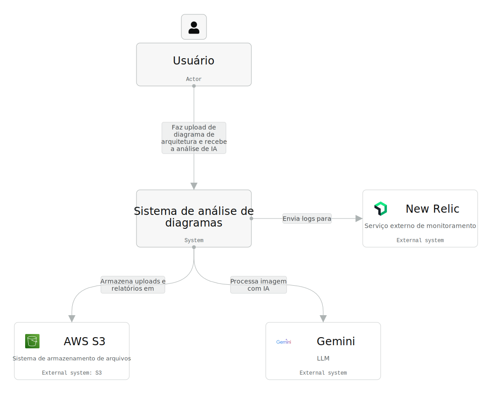
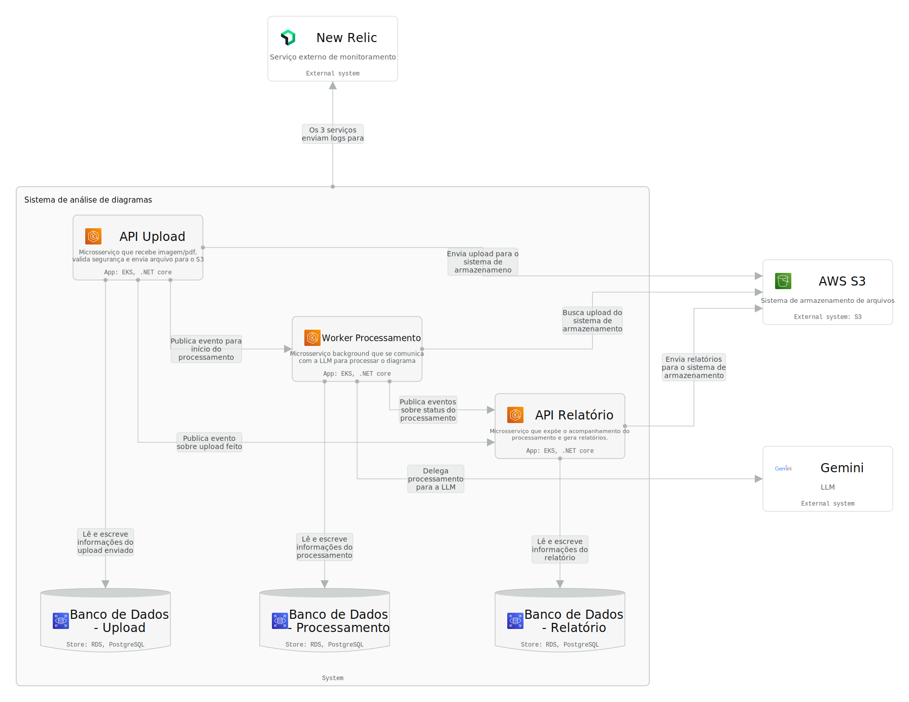
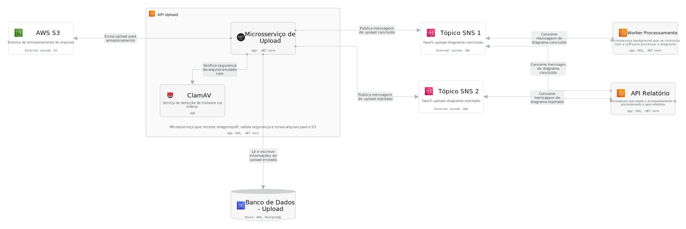
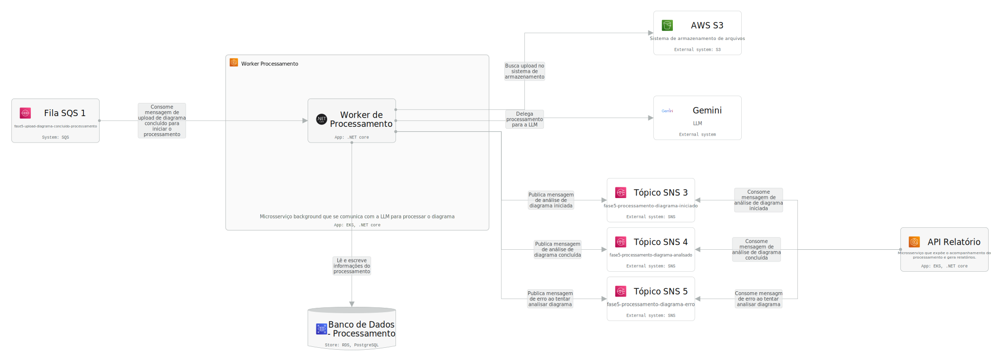
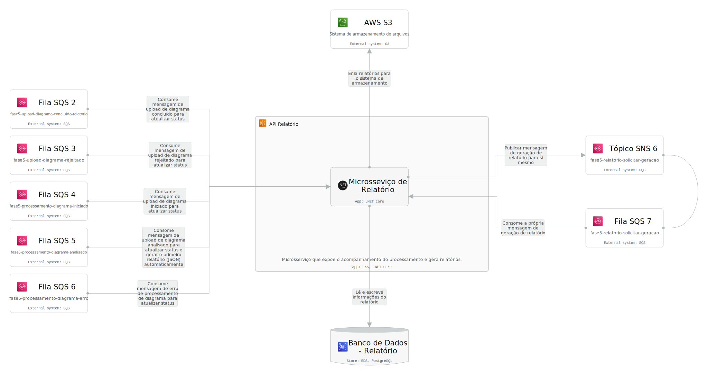

# Diagrama de componentes C4

Este é um Diagrama de Componentes que cobre as visões HLD e LLD usando o modelo C4, com visões para Contexto, Containers e Componentes. O último nível (Código) não foi utilizado pois nenhuma funcionalidade do sistema é complexa o suficiente para que este nível seja relevante.

## Diagrama interativo

[Clique aqui](https://s.icepanel.io/4GWdcqJuVDZZjG/CfkM)

## Diagrama em imagens

### 1° nível - Contexto

### 2° nível - Containers

### 3° nível - Componentes - Upload

### 3° nível - Componentes - Processamento

### 3° nível - Componentes - Relatório

---
Anterior: [Índice](../01%20-%20Entrega/2_indice.md)  
Próximo: [Upload - Funcionamento e fluxos](../03%20-%20Sistemas/01%20-%20Upload/01%20-%20Funcionamento%20e%20fluxos/1_funcionamento_e_fluxos.md)
