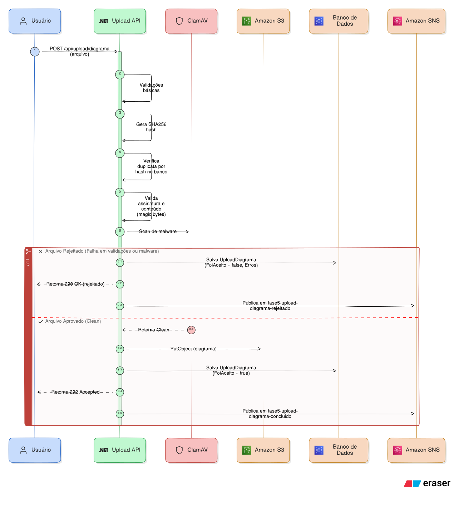

# Funcionamento e fluxos - Upload

O serviço de Upload é a porta de entrada do sistema. Ele recebe imagens de diagramas de arquitetura, valida segurança em três estágios, armazena no S3 e publica uma mensagem para que o serviço de Processamento inicie a análise.

## Visão geral do fluxo

## Endpoints

O serviço expõe dois endpoints principais:

- `POST /api/upload/diagrama` — recebe o arquivo de diagrama e inicia o fluxo de upload
- `GET /api/upload/diagramas` — lista todos os uploads realizados, ordenados por data de criação

Há também o `POST /api/autenticacao/token` para geração de token JWT, usado pelo próprio serviço de Upload e pelo serviço de Relatório para autenticação.

## Fluxo de envio de diagrama

O fluxo do `POST /api/upload/diagrama` passa por cinco etapas sequenciais:

### 1. Criação do aggregate e validação de domínio

Ao receber o arquivo, o aggregate `UploadDiagrama` é criado com `FoiAceito = false`. Os value objects validam:

- **NomeOriginal** — limite de 255 caracteres, rejeita path traversal e caracteres de controle
- **ExtensaoInformada** — valida que a extensão do arquivo é compatível com o Content-Type declarado
- **Tamanho** — máximo de 5MB

Se qualquer validação falhar, o upload é rejeitado antes mesmo de gerar o hash.

### 2. Geração de hash e deduplicação

O conteúdo do arquivo passa por SHA-256 para gerar um hash único. Esse hash é consultado no banco de dados para verificar se já existe um upload aceito com o mesmo conteúdo.

Se já existir, o serviço **reutiliza** o registro existente: caso já tenha concluído o processamento, o retorna, caso tenha falhado republica a mensagem para o serviço de Processamento.

### 3. Validação de segurança em três estágios

Se o arquivo é novo, ele passa por uma pipeline de segurança com três estágios:

1. **Validação de assinatura (magic bytes)** — verifica se os primeiros bytes do arquivo correspondem ao formato declarado. Suporta PNG, JPG, GIF, BMP, WebP e PDF.
2. **Validação de conteúdo** — para imagens, valida dimensões e formato de pixel. Para PDFs, verifica a estrutura e busca conteúdo embutido suspeito (scripts, Java).
3. **Detecção de malware (ClamAV)** — o arquivo é enviado ao ClamAV para varredura. Se um vírus for detectado, o upload é rejeitado com o nome do vírus.

Se qualquer estágio falhar, o upload é marcado como rejeitado, os erros são registrados no aggregate, e uma mensagem `UploadDiagramaRejeitado` é publicada.

### 4. Armazenamento no S3

Arquivos que passaram nas validações são enviados ao AWS S3. O serviço gera um nome físico aleatório (UUID + extensão) e armazena sob o prefixo `diagramas/`. O nome original não é usado como chave no S3.

O aggregate é então marcado como aceito (`FoiAceito = true`) e recebe os `DetalhesArmazenamento` com o nome físico e a URL do S3.

### 5. Persistência e publicação de mensagem

O aggregate é persistido no banco de dados e uma mensagem `UploadDiagramaConcluido` é publicada via MassTransit/SNS. Essa mensagem contém todos os dados necessários para o serviço de Processamento iniciar a análise:

- `AnaliseDiagramaId` — identificador único de rastreamento em toda a pipeline
- `NomeFisico` e `LocalizacaoUrl` — referência ao arquivo no S3
- `NomeOriginal`, `Extensao`, `Tamanho`, `Hash` — metadados do arquivo

O endpoint retorna HTTP 202 (Accepted) com o `AnaliseDiagramaId`.

## Fluxo de listagem

O `GET /api/upload/diagramas` consulta todos os uploads no banco e retorna uma lista com metadados básicos: `AnaliseDiagramaId`, nome original, extensão, tamanho, hash, se foi aceito e data de criação. Não há paginação pois o volume esperado é baixo.

## Mensagens publicadas

| Mensagem | Quando | Consumidor |
|---|---|---|
| `UploadDiagramaConcluido` | Upload aceito e armazenado no S3 | Processamento, Relatório |
| `UploadDiagramaRejeitado` | Arquivo falhou na validação de segurança | Relatório |

O `AnaliseDiagramaId` é o identificador que conecta o upload a todos os serviços downstream. Ele é gerado no momento da criação do aggregate e acompanha o diagrama por toda a pipeline.

---
Anterior: [Diagrama de componentes](../../../02%20-%20Diagrama%20de%20componentes/1_diagrama_de_componentes.md)  
Próximo: [Endpoints - Upload](../02%20-%20Endpoints/1_endpoints_upload.md)
