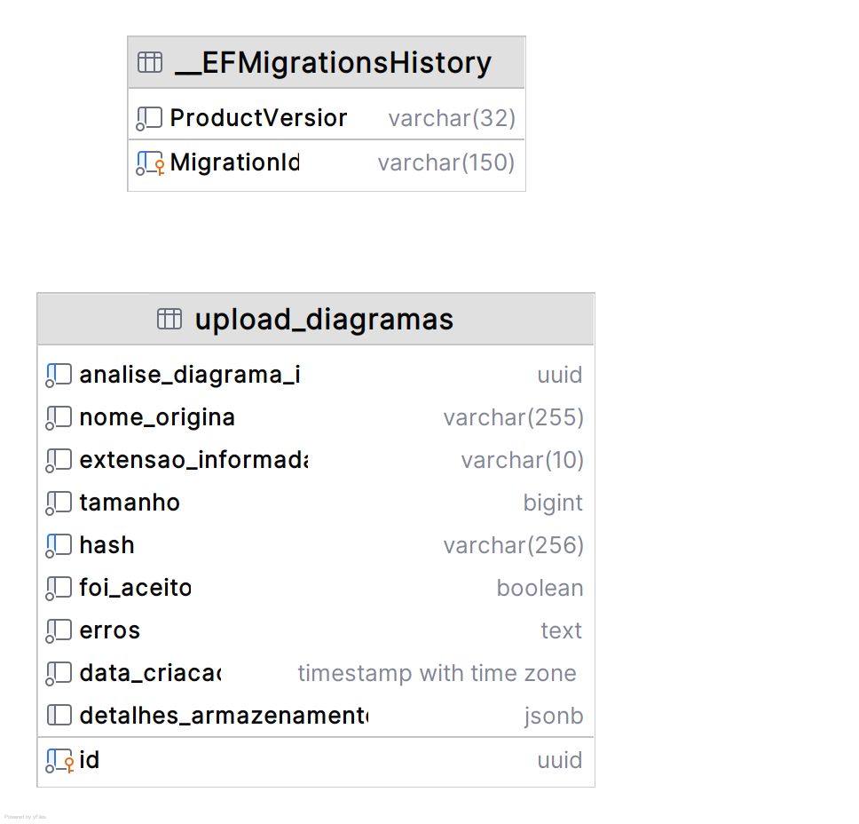

# Banco de dados - Upload

## Escolha do banco de dados
- **Sistema**: PostgreSQL
- **Hospedagem**: Amazon RDS
- **ORM**: Entity Framework Core
- **Terraform**: [fiap-12soat-projeto-fase-5-upload/terraform](https://github.com/joaosena19/fiap-12soat-projeto-fase-5-upload/tree/main/terraform)

O PostgreSQL foi escolhido por familiaridade minha, ser gratuito e por combinar muito bem com o Entity Framework Core no .NET, já sendo a stack consolidada do projeto.

Foi adotada uma abordagem code-first, mapeando as entidades e delegando para o Entity Framework Core a criação das tabelas, definição de campos e relacionamentos.

## Diagrama de Entidade e Relacionamento



## Estrutura

### upload_diagramas

Tabela principal que armazena os registros de upload de diagramas:

| Coluna | Tipo | Obrigatório | Descrição |
|--------|------|:-----------:|-----------|
| `id` | UUID (PK) | Sim | Identificador único do upload |
| `analise_diagrama_id` | UUID (Unique) | Sim | Identificador de rastreamento da análise ao longo do pipeline |
| `nome_original` | VARCHAR(255) | Sim | Nome original do arquivo enviado |
| `extensao_informada` | VARCHAR(10) | Sim | Extensão declarada no upload |
| `tamanho` | BIGINT | Sim | Tamanho do arquivo em bytes |
| `hash` | VARCHAR(256) (Unique) | Sim | Hash SHA-256 do conteúdo para deduplicação |
| `foi_aceito` | BOOLEAN | Sim | Se o arquivo passou em todas as validações de segurança |
| `erros` | TEXT | Não | Lista de erros de validação separados por vírgula |
| `data_criacao` | TIMESTAMP | Sim | Data e hora do upload |
| `detalhes_armazenamento` | JSON | Não | Dados do armazenamento no S3 (nome físico, URL de localização) |

### Esquema JSON — `detalhes_armazenamento`

Preenchido quando o upload é aceito. Armazena os dados de localização do arquivo no S3:

```json
{
  "nomeFisico": {
    "valor": "a1b2c3d4-e5f6-7890-abcd-ef1234567890.png"
  },
  "localizacaoUrl": {
    "valor": "https://fiap-12soat-fase5-upload-diagramas.s3.amazonaws.com/a1b2c3d4-e5f6-7890-abcd-ef1234567890.png"
  }
}
```

### Índices

- **PK**: `id`
- **Unique**: `analise_diagrama_id` — garante que cada upload gera uma única análise
- **Unique**: `hash` — impede uploads duplicados do mesmo arquivo

---
Anterior: [Endpoints - Upload](../02%20-%20Endpoints/1_endpoints_upload.md)  
Próximo: [Arquitetura interna - Upload](../04%20-%20Arquitetura%20interna/1_arquitetura_interna_upload.md)
