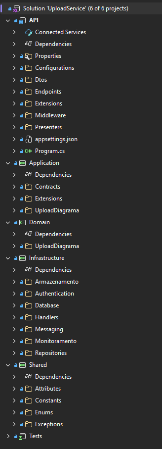

# Arquitetura interna - Upload

## Visão geral

O serviço de Upload segue Clean Architecture com quatro projetos: Domain, Application, Infrastructure e API. A inversão de dependência é feita sem container de DI — cada camada externa instancia os componentes necessários e passa para as camadas internas, que dependem apenas de interfaces.



## Camadas

### Domain (Entities / Enterprise Business Rules)

O aggregate root `UploadDiagrama` encapsula toda a lógica de negócio do upload. Ele é criado com estado `FoiAceito = false` e transiciona para aceito ou rejeitado conforme as validações de segurança.

```csharp
[AggregateRoot]
public class UploadDiagrama
{
    public Guid Id { get; private set; }
    public Guid AnaliseDiagramaId { get; private set; }
    public NomeOriginal NomeOriginal { get; private set; } = null!;
    public ExtensaoInformada ExtensaoInformada { get; private set; } = null!;
    public Tamanho Tamanho { get; private set; } = null!;
    public Hash Hash { get; private set; } = null!;
    public FoiAceito FoiAceito { get; private set; } = null!;
    public List<ErroSegurancaUpload> Erros { get; private set; } = new();
    public DetalhesArmazenamento? DetalhesArmazenamento { get; private set; }
    [...]

    public static UploadDiagrama Criar(string nomeOriginal, string formatoDeclarado, Stream conteudo)
    {
        var nomeOriginalValueObject = new NomeOriginal(nomeOriginal);

        return new UploadDiagrama(
            Uuid.NewSequential(),
            Uuid.NewSequential(),
            nomeOriginalValueObject,
            new ExtensaoInformada(nomeOriginalValueObject.Valor, formatoDeclarado),
            new Tamanho(conteudo),
            FoiAceito.Nao,
            new List<ErroSegurancaUpload>(),
            null,
            new DataCriacao(DateTimeOffset.UtcNow));
    }

    public void AceitarUpload(string nomeFisico, string localizacaoUrl)
    {
        FoiAceito = FoiAceito.Sim;
        DetalhesArmazenamento = DetalhesArmazenamento.Criar(nomeFisico, localizacaoUrl);
    }

    public void RejeitarUpload(List<ErroSegurancaUpload> erros)
    {
        FoiAceito = FoiAceito.Nao;
        Erros = erros;
    }
    [...]
}
```

Os value objects garantem invariantes de negócio diretamente no construtor. Por exemplo, `NomeOriginal` valida path traversal, caracteres de controle e limite de 255 caracteres. `Tamanho` garante o limite de 5MB. `Hash` e `ExtensaoInformada` validam formatos. Cada value object é um `record` com construtor privado e método estático `Criar` ou construtor público com validações.

### Application (Use Cases / Application Business Rules)

Cada caso de uso é uma classe separada. O UseCase recebe todas as dependências via parâmetro do método `ExecutarAsync`, nunca via construtor.

```csharp
public class EnviarArquivoUseCase
{
    public async Task ExecutarAsync(
        string nomeOriginal, string formatoDeclarado, Stream conteudo,
        IUploadDiagramaGateway gateway,
        IGeradorHashArquivo geradorHashArquivo,
        IArmazenamentoArquivoService armazenamentoArquivo,
        IUploadDiagramaMessagePublisher messagePublisher,
        IValidacaoSegurancaArmazenamentoService validacaoSeguranca,
        IEnviarArquivoPresenter presenter,
        IMetricsService metrics,
        IAppLogger logger)
    {
        [...]
        uploadDiagrama = await CriarUploadDiagramaAsync(nomeOriginal, formatoDeclarado, conteudo, geradorHashArquivo);

        if (await TryApresentarUploadExistenteAsync(uploadDiagrama.Hash.Valor, gateway, messagePublisher, presenter, metrics, logger))
            return;
        [...]
        if (!arquivoValido)
        {
            await RejeitarUploadPorSegurancaAsync(uploadDiagrama, motivoRejeicao ?? string.Empty, gateway, messagePublisher);
            throw new DomainException("O arquivo não passou nas validações de segurança", ErrorType.InvalidInput);
        }

        await ArmazenarArquivoAsync(uploadDiagrama, conteudo, armazenamentoArquivo);
        await PersistirUploadConcluidoAsync(uploadDiagrama, gateway, messagePublisher);
        [...]
        presenter.ApresentarSucessoUploadNovo(uploadDiagrama);
        [...]
    }
}
```

O UseCase nunca retorna valores — ele popula o Presenter com o resultado. O tratamento de erros separa `DomainException` (erros de regra de negócio) de `Exception` (erros inesperados), cada um com sua apresentação apropriada.

Os contratos (interfaces) de Gateways, Presenters, Messaging, Armazenamento e Monitoramento vivem no projeto Application:

```
Application/
├── Contracts/
│   ├── Armazenamento/
│   │   ├── IArmazenamentoArquivoService.cs
│   │   ├── IGeradorHashArquivo.cs
│   │   └── IValidacaoSegurancaArmazenamentoService.cs
│   ├── Gateways/
│   │   └── IUploadDiagramaGateway.cs
│   ├── Messaging/
│   │   └── IUploadDiagramaMessagePublisher.cs
│   ├── Monitoramento/
│   │   ├── IAppLogger.cs
│   │   └── IMetricsService.cs
│   └── Presenters/
│       ├── IEnviarArquivoPresenter.cs
│       └── IListarUploadsDiagramaPresenter.cs
├── UploadDiagrama/
│   ├── Dtos/
│   │   └── RetornoUploadDiagramaDto.cs
│   └── UseCases/
│       ├── EnviarArquivoUseCase.cs
│       └── ListarUploadsDiagramaUseCase.cs
```

### Infrastructure (Interface Adapters — implementação)

O Handler é o "Controller" da Clean Architecture (nomeado assim para evitar confusão com o Controller de API do .NET). Ele instancia o UseCase e o Logger, e repassa as dependências:

```csharp
public class UploadDiagramaHandler : BaseHandler
{
    public UploadDiagramaHandler(ILoggerFactory loggerFactory) : base(loggerFactory) { }

    public async Task EnviarArquivoAsync(string nomeOriginal, string formatoDeclarado, Stream conteudo, IUploadDiagramaGateway gateway, IGeradorHashArquivo geradorHashArquivo, IArmazenamentoArquivoService armazenamentoArquivoService, IUploadDiagramaMessagePublisher messagePublisher, IValidacaoSegurancaArmazenamentoService validacaoSegurancaService, IEnviarArquivoPresenter presenter, IMetricsService metrics)
    {
        var useCase = new EnviarArquivoUseCase();
        var logger = CriarLoggerPara<EnviarArquivoUseCase>();

        await useCase.ExecutarAsync(nomeOriginal, formatoDeclarado, conteudo, gateway, geradorHashArquivo, armazenamentoArquivoService, messagePublisher, validacaoSegurancaService, presenter, metrics, logger);
    }
    [...]
}
```

O Repository implementa a interface `IUploadDiagramaGateway` usando Entity Framework Core:

```csharp
public class UploadDiagramaRepository : IUploadDiagramaGateway
{
    private readonly AppDbContext _context;
    [...]

    public async Task<UploadDiagrama> SalvarAsync(UploadDiagrama uploadDiagrama)
    {
        uploadDiagrama.GarantirProntoParaPersistencia();
        var existente = await _context.UploadDiagramas.FindAsync(uploadDiagrama.Id);

        if (existente == null)
            await _context.UploadDiagramas.AddAsync(uploadDiagrama);

        await _context.SaveChangesAsync();
        return uploadDiagrama;
    }
    [...]
}
```

Outras implementações que vivem em Infrastructure:
- `S3ArmazenamentoArquivoService` — armazenamento no Amazon S3
- `GeradorHashSha256` — hash SHA-256 do conteúdo
- `ValidacaoSegurancaArmazenamentoService` — orquestra validação de assinatura, conteúdo e ClamAV
- `UploadDiagramaMessagePublisher` — publicação de mensagens via MassTransit/SNS
- `NewRelicMetricsService` — custom events no New Relic
- `LoggerAdapter` e `ContextualLogger` — logging estruturado com Serilog

### API (Frameworks & Drivers)

O endpoint instancia diretamente as dependências e passa para o Handler, sem container de DI intermediário:

```csharp
[HttpPost("diagrama")]
public async Task<IActionResult> EnviarDiagrama(IFormFile arquivo)
{
    [...]
    var gateway = new UploadDiagramaRepository(_context);
    var presenter = new EnviarArquivoPresenter();
    var handler = new UploadDiagramaHandler(_loggerFactory);
    var geradorHash = new GeradorHashSha256();
    var metrics = new NewRelicMetricsService();

    await handler.EnviarArquivoAsync(nomeOriginal, formatoDeclarado, stream, gateway, geradorHash, _armazenamento, _messagePublisher, _validacaoSeguranca, presenter, metrics);

    return presenter.ObterResultado();
}
```

O Presenter é definido no projeto API, pois é ele quem decide a forma de apresentação. A implementação converte o aggregate em DTO e define o `IActionResult`:

```csharp
public class EnviarArquivoPresenter : BasePresenter, IEnviarArquivoPresenter
{
    public void ApresentarSucessoUploadNovo(UploadDiagrama uploadDiagrama)
    {
        _resultado = new AcceptedResult(string.Empty, CriarDto(uploadDiagrama));
        _foiSucesso = true;
    }

    public void ApresentarSucessoUploadExistente(UploadDiagrama uploadDiagrama)
    {
        DefinirSucesso(CriarDto(uploadDiagrama));
    }
    [...]
}
```

---
Anterior: [Banco de dados - Upload](../03%20-%20Banco%20de%20dados/1_banco_de_dados_upload.md)  
Próximo: [Funcionamento e fluxos - Processamento](../../02%20-%20Processamento/01%20-%20Funcionamento%20e%20fluxos/1_funcionamento_e_fluxos.md)
