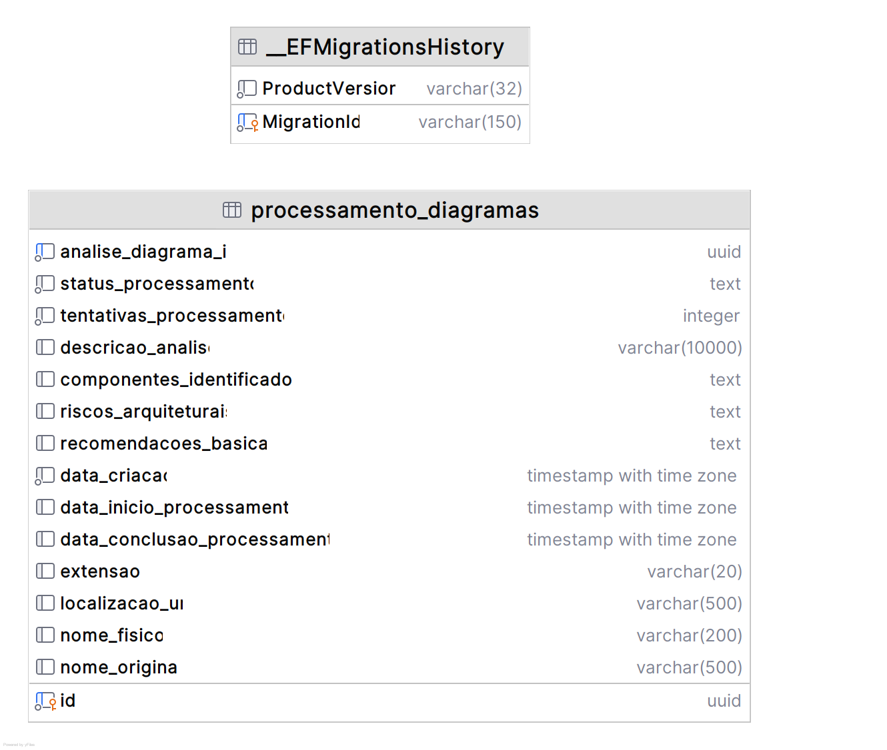

# Banco de dados - Processamento

## Escolha do banco de dados
- **Sistema**: PostgreSQL
- **Hospedagem**: Amazon RDS
- **ORM**: Entity Framework Core
- **Terraform**: [fiap-12soat-projeto-fase-5-processamento/terraform](https://github.com/joaosena19/fiap-12soat-projeto-fase-5-processamento/tree/main/terraform)

O PostgreSQL foi escolhido por familiaridade minha, ser gratuito e por combinar muito bem com o Entity Framework Core no .NET, já sendo a stack consolidada do projeto.

Foi adotada uma abordagem code-first, mapeando as entidades e delegando para o Entity Framework Core a criação das tabelas, definição de campos e relacionamentos.

## Diagrama de Entidade e Relacionamento



## Estrutura

### processamento_diagramas

Tabela principal que armazena os registros de processamento de diagramas:

| Coluna | Tipo | Obrigatório | Descrição |
|--------|------|:-----------:|-----------|
| `id` | UUID (PK) | Sim | Identificador único do processamento |
| `analise_diagrama_id` | UUID (Unique) | Sim | Identificador de rastreamento da análise ao longo do pipeline |
| `status_processamento` | VARCHAR | Sim | Status do processamento (enum armazenado como texto lowercase) |
| `tentativas_processamento` | INT | Sim | Número de tentativas de processamento realizadas |
| `data_criacao` | TIMESTAMP | Sim | Data de criação do registro |
| `data_inicio_processamento` | TIMESTAMP | Não | Data em que o processamento começou |
| `data_conclusao_processamento` | TIMESTAMP | Não | Data em que o processamento terminou |
| `descricao_analise` | VARCHAR(10000) | Não | Descrição textual da análise realizada pela LLM |
| `componentes_identificados` | JSON | Não | Lista de componentes identificados no diagrama |
| `riscos_arquiteturais` | JSON | Não | Lista de riscos arquiteturais identificados |
| `recomendacoes_basicas` | JSON | Não | Lista de recomendações básicas geradas |
| `localizacao_url` | VARCHAR(500) | Sim | URL do arquivo no S3 |
| `nome_fisico` | VARCHAR(200) | Não | Nome físico do arquivo no S3 |
| `nome_original` | VARCHAR(500) | Não | Nome original do arquivo enviado |
| `extensao` | VARCHAR(20) | Não | Extensão do arquivo |

### Esquema JSON — `componentes_identificados`

Array simples de strings, cada uma representando um componente identificado pela LLM no diagrama:

```json
["API Gateway", "Serviço de Upload", "Fila SQS", "Banco PostgreSQL", "Bucket S3"]
```

### Esquema JSON — `riscos_arquiteturais`

Array simples de strings com os riscos arquiteturais identificados:

```json
["Ponto único de falha no API Gateway", "Ausência de circuit breaker entre serviços"]
```

### Esquema JSON — `recomendacoes_basicas`

Array simples de strings com as recomendações geradas:

```json
["Implementar circuit breaker", "Adicionar cache distribuído", "Configurar retry com backoff exponencial"]
```

### Índices

- **PK**: `id`
- **Unique**: `analise_diagrama_id` — garante um processamento por análise

---
Anterior: [Funcionamento e fluxos - Processamento](../01%20-%20Funcionamento%20e%20fluxos/1_funcionamento_e_fluxos.md)  
Próximo: [Arquitetura interna - Processamento](../03%20-%20Arquitetura%20interna/1_arquitetura_interna_processamento.md)
