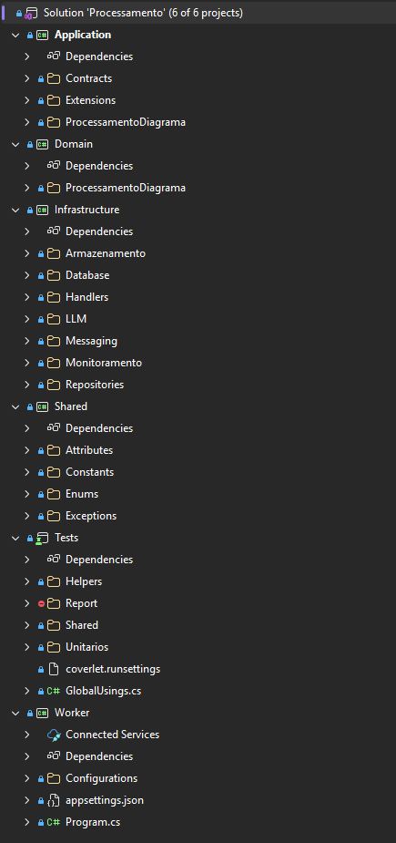

# Arquitetura interna - Processamento

## Visão geral

O serviço de Processamento segue Clean Architecture com quatro projetos: Domain, Application, Infrastructure e Worker. A diferença fundamental em relação ao serviço de Upload é o ponto de entrada: aqui não existe API HTTP. O Worker consome mensagens via MassTransit/SQS, e o Consumer instancia os componentes de Clean Architecture da mesma forma que um endpoint faria.



## Camadas

### Domain (Entities / Enterprise Business Rules)

O aggregate root `ProcessamentoDiagrama` implementa uma máquina de estados que governa todo o ciclo de vida do processamento. Os estados são: `AguardandoProcessamento`, `EmProcessamento`, `Concluido`, `Rejeitado` e `Falha`.

```csharp
[AggregateRoot]
public class ProcessamentoDiagrama
{
    public Guid Id { get; private set; }
    public Guid AnaliseDiagramaId { get; private set; }
    public StatusProcessamento StatusProcessamento { get; private set; } = null!;
    public TentativasProcessamento TentativasProcessamento { get; private set; } = null!;
    public AnaliseResultado? AnaliseResultado { get; private set; }
    public DadosOrigem? DadosOrigem { get; private set; }
    public HistoricoTemporal HistoricoTemporal { get; private set; } = null!;
    [...]

    public static ProcessamentoDiagrama Criar(Guid analiseDiagramaId)
    {
        if (analiseDiagramaId == Guid.Empty)
            throw new DomainException("AnaliseDiagramaId não pode ser vazio");

        return new ProcessamentoDiagrama(
            Uuid.NewSequential(),
            analiseDiagramaId,
            new StatusProcessamento(StatusProcessamentoEnum.AguardandoProcessamento),
            new TentativasProcessamento(0),
            HistoricoTemporal.Criar(),
            null);
    }

    public void IniciarProcessamento()
    {
        if (StatusProcessamento.Valor != StatusProcessamentoEnum.AguardandoProcessamento && StatusProcessamento.Valor != StatusProcessamentoEnum.Falha)
            throw new DomainException("Só é possível iniciar processamento quando o status é AguardandoProcessamento ou Falha");

        StatusProcessamento = new StatusProcessamento(StatusProcessamentoEnum.EmProcessamento);
        HistoricoTemporal = HistoricoTemporal.MarcarInicioProcessamento();
    }

    public void ConcluirProcessamento(string descricaoAnalise, List<string> componentesIdentificados, List<string> riscosArquiteturais, List<string> recomendacoesBasicas, int tentativasRealizadas)
    {
        [...]
        AnaliseResultado = AnaliseResultado.Criar(descricaoAnalise, componentesIdentificados, riscosArquiteturais, recomendacoesBasicas);
        TentativasProcessamento = new TentativasProcessamento(tentativasRealizadas);
        StatusProcessamento = new StatusProcessamento(StatusProcessamentoEnum.Concluido);
        HistoricoTemporal = HistoricoTemporal.MarcarConclusaoProcessamento();
    }

    public void RegistrarFalha(int tentativasRealizadas) { [...] }
    public void RegistrarRejeicao(int tentativasRealizadas) { [...] }
    public void RegistrarDadosOrigem(string localizacaoUrl, string nomeFisico, string nomeOriginal, string extensao) { [...] }
}
```

O value object `StatusProcessamento` valida que o valor informado pertence ao enum `StatusProcessamentoEnum`. As regras de transição vivem nos métodos do aggregate (`IniciarProcessamento`, `ConcluirProcessamento`, `RegistrarFalha`, `RegistrarRejeicao`), que validam o estado atual antes de transicionar. A entidade `DadosOrigem` guarda referência ao arquivo no S3, e `AnaliseResultado` armazena a saída da LLM.

### Application (Use Cases / Application Business Rules)

O UseCase `ProcessarDiagramaUseCase` é o ponto central da camada de aplicação: obtém o aggregate, valida dados, delega ao serviço de LLM e trata o resultado (sucesso, rejeição, falha).

```csharp
public class ProcessarDiagramaUseCase
{
    public async Task ExecutarAsync(ProcessarDiagramaDto processarDiagramaDto, IProcessamentoDiagramaGateway gateway, IDiagramaAnaliseService llmService, IProcessamentoDiagramaMessagePublisher messagePublisher, IMetricsService metrics, IAppLogger logger)
    {
        [...]
        var processamentoDiagrama = await ObterProcessamentoValidadoAsync(analiseDiagramaId, gateway);

        ValidarDadosObrigatorios(processarDiagramaDto, logger);

        await SinalizarInicioProcessamentoAsync(processamentoDiagrama, processarDiagramaDto, gateway, messagePublisher, metrics);

        var resultado = await llmService.AnalisarDiagramaAsync(analiseDiagramaId, processarDiagramaDto.NomeFisico, processarDiagramaDto.LocalizacaoUrl, processarDiagramaDto.Extensao);

        if (resultado.Sucesso)
            await TratarSucessoAsync(processamentoDiagrama, resultado, inicioProcessamento, gateway, messagePublisher, metrics, logger);
        else if (resultado.Rejeitado)
            await TratarRejeicaoAsync(processamentoDiagrama, resultado, gateway, messagePublisher, metrics, logger);
        else
            await TratarFalhaAsync(processamentoDiagrama, resultado, gateway, messagePublisher, metrics, logger);
    }
}
```

Os contratos de Application definem as interfaces que a camada de Infrastructure implementa:

```
Application/
├── Contracts/
│   ├── Gateways/
│   │   └── IProcessamentoDiagramaGateway.cs
│   ├── LLM/
│   │   ├── IDiagramaAnaliseService.cs
│   │   └── ResultadoAnaliseDto.cs
│   ├── Messaging/
│   │   └── IProcessamentoDiagramaMessagePublisher.cs
│   └── Monitoramento/
│       ├── IAppLogger.cs
│       ├── ICorrelationIdAccessor.cs
│       └── IMetricsService.cs
├── ProcessamentoDiagrama/
│   ├── Dtos/
│   │   └── ProcessarDiagramaDto.cs
│   └── UseCases/
│       └── ProcessarDiagramaUseCase.cs
```

Um aspecto importante: **não existem Presenters neste serviço**. O Worker não responde a um cliente HTTP — o resultado do processamento é comunicado via mensagens publicadas por `IProcessamentoDiagramaMessagePublisher`.

### Infrastructure (Interface Adapters — implementação)

O Handler funciona como o "Controller" da Clean Architecture. Além de instanciar o UseCase, ele implementa lógica de **deduplicação** e **recuperação de dados** na fronteira entre infraestrutura e aplicação (detalhes em [Funcionamento e fluxos](../01%20-%20Funcionamento%20e%20fluxos/1_funcionamento_e_fluxos.md)):

```csharp
public class ProcessamentoDiagramaHandler : BaseHandler
{
    private static readonly HashSet<StatusProcessamentoEnum> StatusTerminaisOuEmAndamento =
    [
        StatusProcessamentoEnum.EmProcessamento,
        StatusProcessamentoEnum.Concluido,
        StatusProcessamentoEnum.Rejeitado
    ];

    public async Task IniciarProcessamentoAsync(ProcessarDiagramaDto processarDiagramaDto, IProcessamentoDiagramaGateway gateway, IDiagramaAnaliseService llmService, IProcessamentoDiagramaMessagePublisher messagePublisher, IMetricsService metrics, IAppLogger logger)
    {
        var processamentoExistente = await gateway.ObterPorAnaliseDiagramaIdAsync(processarDiagramaDto.AnaliseDiagramaId);

        if (DeveIgnorar(processamentoExistente, processarDiagramaDto.AnaliseDiagramaId, logger))
            return;

        processarDiagramaDto = TentarRecuperarLocalizacaoUrl(processarDiagramaDto, processamentoExistente, logger);
        [...]

        await ProcessarDiagramaAsync(processarDiagramaDto, gateway, llmService, messagePublisher, metrics);
    }
    [...]
}
```

O `DiagramaAnaliseService` implementa `IDiagramaAnaliseService` e contém a integração com LLM. Ele baixa a imagem do S3 via `IArquivoDiagramaDownloader`, tenta múltiplos modelos em sequência de fallback e usa Polly para retry com backoff exponencial (detalhes da estratégia de resiliência em [Funcionamento e fluxos](../01%20-%20Funcionamento%20e%20fluxos/1_funcionamento_e_fluxos.md)):

```csharp
public class DiagramaAnaliseService : IDiagramaAnaliseService
{
    private readonly LlmOptions _opcoes;
    private readonly ILlmClientFactory _clientFactory;
    private readonly IArquivoDiagramaDownloader _arquivoDiagramaDownloader;
    private readonly IAppLogger _logger;
    private readonly ResiliencePipeline<ResultadoAnaliseDto> _pipeline;
    [...]

    public async Task<ResultadoAnaliseDto> AnalisarDiagramaAsync(Guid analiseDiagramaId, string nomeFisico, string localizacaoUrl, string extensao)
    {
        [...]
        byte[] conteudoArquivo;
        try
        {
            conteudoArquivo = await BaixarConteudoArquivoAsync(localizacaoUrl);
        }
        catch (Exception ex)
        {
            [...]
            return CriarResultadoFalha(ex, 0, OrigemErroConstantes.Armazenamento);
        }

        var resultado = await TentarAnalisarComFallbackAsync(analiseDiagramaId, nomeFisico, conteudoArquivo, extensao);
        [...]
    }
    [...]
}
```

### Worker (Frameworks & Drivers)

O ponto de entrada é o Consumer MassTransit. Assim como o endpoint no serviço de Upload instancia componentes diretamente, o Consumer faz o mesmo:

```csharp
public class UploadDiagramaConcluidoConsumer : IConsumer<UploadDiagramaConcluidoDto>
{
    private readonly AppDbContext _context;
    private readonly IDiagramaAnaliseService _llmService;
    private readonly IProcessamentoDiagramaMessagePublisher _messagePublisher;
    private readonly ILoggerFactory _loggerFactory;
    [...]

    public async Task Consume(ConsumeContext<UploadDiagramaConcluidoDto> context)
    {
        [...]
        var handler = new ProcessamentoDiagramaHandler(_loggerFactory);
        var gateway = new ProcessamentoDiagramaRepository(_context);
        var metrics = new NewRelicMetricsService();
        [...]

        await handler.IniciarProcessamentoAsync(processarDiagramaDto, gateway, _llmService, _messagePublisher, metrics, logger);
        [...]
    }
}
```

O `IDiagramaAnaliseService` é injetado via DI do .NET no Consumer por ser mais complexo (requer configuração de múltiplos modelos, pipeline do Polly, downloader). O Handler, Gateway e Metrics são instanciados diretamente. O MassTransit é configurado com processamento sequencial (`ConcurrentMessageLimit = 1`, `PrefetchCount = 1`) pois cada mensagem envolve chamada a LLM.

---
Anterior: [Banco de dados - Processamento](../02%20-%20Banco%20de%20dados/1_banco_de_dados_processamento.md)  
Próximo: [Funcionamento e fluxos - Relatórios](../../03%20-%20Relatórios/01%20-%20Funcionamento%20e%20fluxos/1_funcionamento_e_fluxos.md)
