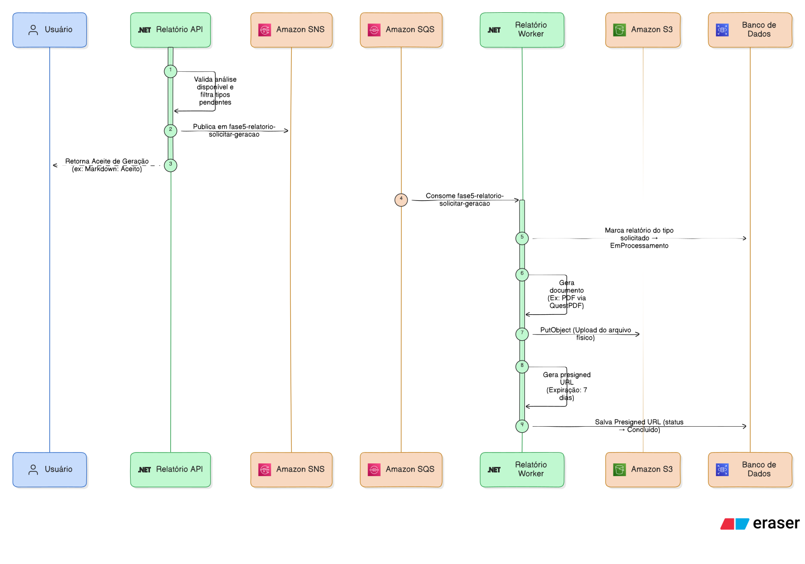
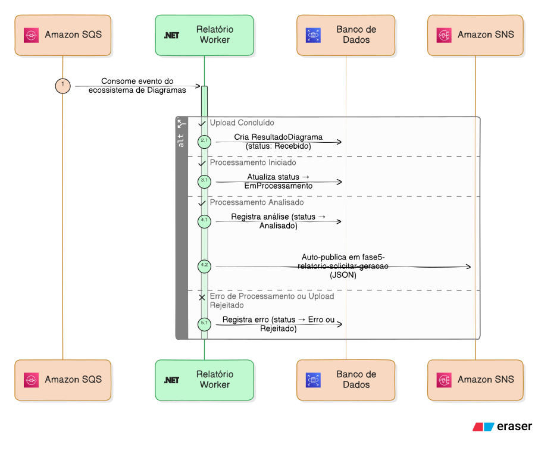

# Funcionamento e fluxos - Relatórios

O serviço de Relatórios é um sistema híbrido: expõe endpoints HTTP para consulta e solicitação de relatórios, e consome mensagens dos serviços de Upload e Processamento para manter o estado atualizado e gerar relatórios automaticamente. Ele é o último elo da pipeline.

O serviço de Relatórios consome a análise do diagrama feita pelo serviço de Processamento, que ocorre uma única vez. O serviço de Relatórios apenas transforma esses dados em diferentes formatos de saída — JSON, Markdown, PDF.

## Visão geral dos fluxos

#### Geração de relatórios



#### Acompanhamento de status



## Pontos de entrada (consumers)

O serviço consome seis tipos de mensagem, cada uma atualizando o aggregate `ResultadoDiagrama` conforme o progresso na pipeline:

| Consumer | Mensagem consumida | Ação |
|---|---|---|
| `UploadDiagramaConcluidoConsumer` | Upload concluído | Cria o aggregate com status `Recebido` |
| `UploadDiagramaRejeitadoConsumer` | Upload rejeitado na validação | Cria ou marca como `Erro` |
| `ProcessamentoDiagramaIniciadoConsumer` | Processamento iniciou | Cria se não existir, marca `EmProcessamento` |
| `ProcessamentoDiagramaAnalisadoConsumer` | Análise concluída com sucesso | Registra `AnaliseResultado`, dispara geração automática |
| `ProcessamentoDiagramaErroConsumer` | Processamento falhou ou rejeitou | Marca como `Erro` ou `Rejeitado` |
| `SolicitarGeracaoRelatoriosConsumer` | Solicitação de geração | Executa geração de relatório por tipo |

### Fluxo automático de geração

Quando o `ProcessamentoDiagramaAnalisadoConsumer` recebe a mensagem de análise concluída, ele registra o `AnaliseResultado` no aggregate e publica uma mensagem `SolicitarGeracaoRelatorios` com os tipos padrão definidos na constante `TiposRelatorioPadrao`. Atualmente, essa constante contém apenas `TipoRelatorioEnum.Json` — o relatório JSON é gerado automaticamente após cada análise.

O `SolicitarGeracaoRelatoriosConsumer` então gera cada relatório usando o Strategy Pattern.

Se o aggregate já existia com status `Erro` (falha anterior), o consumer detecta o reprocessamento e chama `PrepararParaReprocessamento()`, que limpa a análise anterior e reseta os relatórios antes de registrar a nova análise.

### Configuração de geração automática

Alterar quais relatórios são gerados automaticamente é trivial. A constante `TiposRelatorioPadrao` é uma `IReadOnlyCollection<TipoRelatorioEnum>`:

```csharp
public static readonly IReadOnlyCollection<TipoRelatorioEnum> Tipos = [TipoRelatorioEnum.Json];
```

Para gerar Markdown e PDF automaticamente além do JSON, basta alterar para:

```csharp
public static readonly IReadOnlyCollection<TipoRelatorioEnum> Tipos = [
    TipoRelatorioEnum.Json,
    TipoRelatorioEnum.Markdown,
    TipoRelatorioEnum.Pdf
];
```

Optei por manter apenas JSON como automático Markdown e PDF ficam disponíveis sob demanda via `POST /api/relatorio/{id}`, pois envolvem upload ao S3.

### Criação e idempotência

O aggregate `ResultadoDiagrama` pode ser criado por três consumers diferentes (`UploadConcluido`, `UploadRejeitado`, `ProcessamentoIniciado`), dependendo de qual mensagem chegar primeiro. Cada consumer verifica se o aggregate já existe antes de criar, e usa constraint de unicidade no banco como proteção adicional contra concorrência.

## Pontos de entrada HTTP (endpoints)

O serviço expõe três endpoints REST:

### GET `/api/relatorio`

Lista todos os resultados de diagramas com status consolidado. Para cada resultado, retorna o `AnaliseDiagramaId`, o status geral, quais relatórios estão disponíveis, quantidade de erros e datas.

### GET `/api/relatorio/{analiseDiagramaId}`

Busca um resultado específico com todos os detalhes: status do aggregate, lista de relatórios gerados (com tipo, status, conteúdo e data), e histórico de erros. Retorna 404 se o `AnaliseDiagramaId` não existir.

### POST `/api/relatorio/{analiseDiagramaId}`

Solicita a geração (ou re-geração) de relatórios. O corpo da requisição contém a lista de `TiposRelatorio` desejados (JSON, Markdown, PDF). O UseCase avalia cada tipo individualmente:

- **Concluido** — o relatório já foi gerado. Retorna 200.
- **JaEmAndamento** — o relatório está sendo gerado neste momento. Retorna 202.
- **AceitoParaGeracao** — o relatório precisa ser gerado. O tipo é marcado como `Solicitado`, e uma mensagem é publicada para geração assíncrona. Retorna 202.

Se a requisição contém tipos com respostas mistas (ex: um Concluido e um AceitoParaGeracao), o endpoint retorna HTTP 207 (Multi-Status) com o detalhe por tipo.

## Geração de relatórios via Strategy Pattern

A geração usa Strategy Pattern — cada formato de saída é uma strategy independente, resolvida pelo `IRelatorioStrategyResolver`. Detalhes do padrão e da extensibilidade em [Arquitetura interna](../04%20-%20Arquitetura%20interna/1_arquitetura_interna_relatorio.md).

### Strategies existentes

| Strategy | Formato | Armazenamento |
|---|---|---|
| `RelatorioJsonStrategy` | JSON | Inline no banco |
| `RelatorioMarkdownStrategy` | Markdown | Inline no banco + S3 |
| `RelatorioPdfStrategy` | PDF (QuestPDF) | S3 |

## Ciclo de vida do aggregate

O aggregate `ResultadoDiagrama` gerencia duas dimensões de estado:

### Status do aggregate (pipeline)

| Status | Significado |
|---|---|
| `Recebido` | Upload concluído, aguardando processamento |
| `EmProcessamento` | Análise em andamento |
| `Analisado` | Análise concluída, relatórios podem ser gerados |
| `Erro` | Falha no processamento (permite retry) |
| `Rejeitado` | Imagem inválida (terminal) |

### Status de cada relatório

| Status | Significado |
|---|---|
| `NaoSolicitado` | Relatório não foi solicitado |
| `Automatico` | Solicitado automaticamente após análise |
| `Solicitado` | Solicitado via HTTP |
| `EmProcessamento` | Geração em andamento |
| `Concluido` | Relatório gerado com sucesso |
| `Erro` | Falha na geração (permite retry) |

## Fluxo completo — da análise ao relatório

1. O `ProcessamentoDiagramaAnalisadoConsumer` recebe a mensagem de análise concluída
2. O consumer registra o `AnaliseResultado` no aggregate e transiciona para `Analisado`
3. O consumer publica `SolicitarGeracaoRelatorios` com os tipos padrão (JSON)
4. O `SolicitarGeracaoRelatoriosConsumer` recebe a mensagem e itera sobre os tipos
5. Para cada tipo, o `GerarRelatorioUseCase` resolve a strategy, marca o relatório como `EmProcessamento` e executa
6. A strategy gera o conteúdo no formato apropriado e retorna os `Conteudos`
7. O UseCase chama `ConcluirRelatorio(...)` no aggregate, que registra conteúdos e marca `Concluido`
8. Se a strategy falhar, o relatório é marcado como `Erro` e um `ErroResultadoDiagrama` é adicionado ao histórico
9. O usuário pode solicitar geração de Markdown e PDF via `POST /api/relatorio/{id}`, que segue o mesmo fluxo

---
Anterior: [Arquitetura interna - Processamento](../../02%20-%20Processamento/03%20-%20Arquitetura%20interna/1_arquitetura_interna_processamento.md)  
Próximo: [Endpoints - Relatório](../02%20-%20Endpoints/1_endpoints_relatorio.md)
