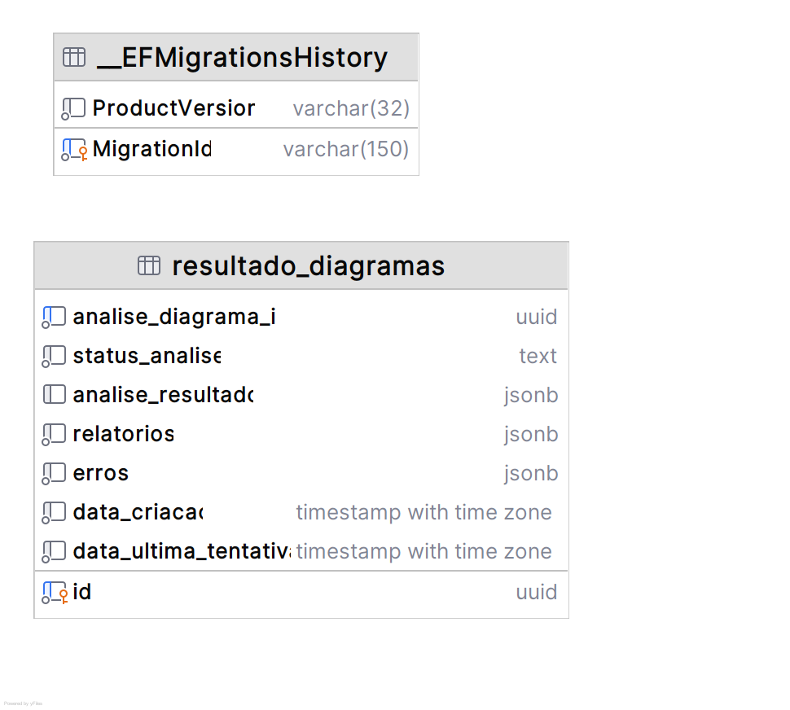

# Banco de dados - Relatório

## Escolha do banco de dados
- **Sistema**: PostgreSQL
- **Hospedagem**: Amazon RDS
- **ORM**: Entity Framework Core
- **Terraform**: [fiap-12soat-projeto-fase-5-relatorio/terraform](https://github.com/joaosena19/fiap-12soat-projeto-fase-5-relatorio/tree/main/terraform)

O PostgreSQL foi escolhido pois os dados de relatório combinam colunas estruturadas (status, timestamps) com payloads JSON variáveis (relatórios gerados, resultado da análise). O suporte nativo a JSONB do PostgreSQL permite consultas eficientes nessas colunas sem abrir mão da integridade relacional. A combinação PostgreSQL + Entity Framework Core funciona muito bem com .NET e já é a stack consolidada do projeto.

Foi adotada uma abordagem code-first, mapeando as entidades e delegando para o Entity Framework Core a criação das tabelas, definição de campos e relacionamentos.

## Diagrama de Entidade e Relacionamento



## Estrutura

### resultado_diagramas

Tabela principal que armazena os resultados e relatórios gerados para cada análise de diagrama:

| Coluna | Tipo | Obrigatório | Descrição |
|--------|------|:-----------:|-----------|
| `id` | UUID (PK) | Sim | Identificador único do resultado |
| `analise_diagrama_id` | UUID (Unique) | Sim | Identificador de rastreamento da análise ao longo do pipeline |
| `status_analise` | VARCHAR | Sim | Status geral da análise (enum armazenado como texto lowercase) |
| `data_criacao` | TIMESTAMP | Sim | Data de criação do registro |
| `data_ultima_tentativa` | TIMESTAMP | Sim | Data da última tentativa de geração de relatório |
| `relatorios` | JSONB | Não | Array de relatórios gerados, cada um com tipo, status e conteúdo |
| `erros` | JSONB | Não | Array de erros ocorridos durante a geração |
| `analise_resultado` | JSONB | Não | Resultado consolidado da análise (descrição, componentes, riscos, recomendações) |

### Esquema JSONB — `relatorios`

Array de objetos, cada um representando um tipo de relatório. Os enums são serializados como string via `JsonStringEnumConverter`:

```json
[
  {
    "tipo": "Json",
    "status": "Concluido",
    "conteudos": {
      "json": "{ ... conteúdo do relatório em JSON ... }"
    },
    "dataGeracao": "2026-04-19T14:30:00+00:00"
  },
  {
    "tipo": "Markdown",
    "status": "Concluido",
    "conteudos": {
      "markdown": "# Relatório de Análise\n\n..."
    },
    "dataGeracao": "2026-04-19T14:30:05+00:00"
  },
  {
    "tipo": "Pdf",
    "status": "NaoSolicitado",
    "conteudos": {},
    "dataGeracao": null
  }
]
```

Valores possíveis para `tipo`: `Json`, `Markdown`, `Pdf`

Valores possíveis para `status`: `NaoSolicitado`, `Automatico`, `Solicitado`, `EmProcessamento`, `Concluido`, `Erro`

O campo `conteudos` é um dicionário chave/valor onde a chave identifica o formato e o valor é o conteúdo gerado. Fica vazio (`{}`) enquanto o relatório não for concluído.

### Esquema JSONB — `erros`

Array de objetos com o histórico de erros ocorridos durante o processamento:

```json
[
  {
    "mensagem": "Timeout ao chamar a LLM após 3 tentativas",
    "tipoRelatorio": null,
    "origemErro": "Llm",
    "numeroTentativa": 2,
    "dataOcorrencia": "2026-04-19T14:25:00+00:00"
  },
  {
    "mensagem": "Falha ao gerar relatório PDF: template não encontrado",
    "tipoRelatorio": "Pdf",
    "origemErro": "GeracaoRelatorio",
    "numeroTentativa": null,
    "dataOcorrencia": "2026-04-19T14:35:00+00:00"
  }
]
```

Valores possíveis para `origemErro`: `Processamento`, `Llm`, `LlmValidacao`, `Armazenamento`, `GeracaoRelatorio`, `Desconhecido`

O campo `tipoRelatorio` é preenchido apenas quando o erro é específico de um relatório. Quando é nulo, indica um erro geral do processamento.

### Esquema JSONB — `analise_resultado`

Objeto com o resultado consolidado da análise feita pela LLM. Fica `null` até o processamento concluir a análise:

```json
{
  "descricaoAnalise": "O diagrama apresenta uma arquitetura de microsserviços com 5 componentes principais...",
  "componentesIdentificados": [
    "API Gateway",
    "Serviço de Upload",
    "Fila SQS",
    "Banco PostgreSQL",
    "Bucket S3"
  ],
  "riscosArquiteturais": [
    "Ponto único de falha no API Gateway",
    "Ausência de circuit breaker entre serviços"
  ],
  "recomendacoesBasicas": [
    "Implementar circuit breaker",
    "Adicionar cache distribuído",
    "Configurar retry com backoff exponencial"
  ]
}
```

### Índices

- **PK**: `id`
- **Unique**: `analise_diagrama_id` — garante um resultado por análise

### Sobre o uso de JSONB

As colunas `relatorios`, `erros` e `analise_resultado` utilizam o tipo JSONB do PostgreSQL. Essa escolha se deu pois o conteúdo dos relatórios é variável (cada tipo de relatório tem sua própria estrutura) e o JSONB permite armazená-los de forma flexível enquanto ainda possibilita consultas indexadas quando necessário.

---
Anterior: [Endpoints - Relatório](../02%20-%20Endpoints/1_endpoints_relatorio.md)  
Próximo: [Arquitetura interna - Relatório](../04%20-%20Arquitetura%20interna/1_arquitetura_interna_relatorio.md)
