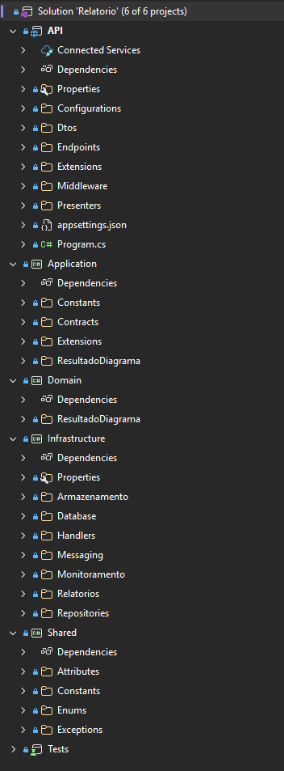

# Arquitetura interna - Relatórios

## Visão geral

O serviço de Relatórios segue Clean Architecture com quatro projetos: Domain, Application, Infrastructure e API. É um serviço híbrido: expõe endpoints HTTP para consulta e solicitação de relatórios, e consome mensagens via MassTransit/SQS para geração assíncrona.



## Camadas

### Domain (Entities / Enterprise Business Rules)

O aggregate root `ResultadoDiagrama` é o mais complexo dos três serviços. Ele gerencia uma coleção de `RelatorioGerado` (entity filha), além de `ErroResultadoDiagrama` para histórico de falhas e `AnaliseResultado` para os dados vindos do processamento.

```csharp
[AggregateRoot]
public class ResultadoDiagrama
{
    public Guid Id { get; private set; }
    public Guid AnaliseDiagramaId { get; private set; }
    public StatusResultadoDiagrama Status { get; private set; } = null!;
    public AnaliseResultado? AnaliseResultado { get; private set; }
    public List<RelatorioGerado> Relatorios { get; private set; } = new();
    public List<ErroResultadoDiagrama> Erros { get; private set; } = new();
    [...]

    public void RegistrarAnalise(AnaliseResultado analiseResultado)
    {
        AnaliseResultado = analiseResultado;
        Status = new StatusResultadoDiagrama(StatusAnaliseEnum.Analisado);
    }

    public void ConcluirRelatorio(TipoRelatorioEnum tipoRelatorio, ConteudosRelatorio conteudos)
    {
        ObterRelatorio(tipoRelatorio).Concluir(conteudos);
    }

    public void RegistrarFalhaRelatorio(TipoRelatorioEnum tipoRelatorio, string mensagem)
    {
        ObterRelatorio(tipoRelatorio).RegistrarErro();
        Erros.Add(ErroResultadoDiagrama.Criar(mensagem, tipoRelatorio, OrigemErroEnum.GeracaoRelatorio, null));
    }

    public void PrepararParaReprocessamento() { [...] }
    [...]
}
```

A entity `RelatorioGerado` tem seu próprio ciclo de vida (NaoSolicitado/Automatico → Solicitado → EmProcessamento → Concluido/Erro), e o aggregate gerencia a coleção de relatórios via métodos como `ConcluirRelatorio`, `MarcarRelatorioEmProcessamento` e `RegistrarFalhaRelatorio`:

```csharp
[AggregateMember]
public class RelatorioGerado
{
    public TipoRelatorio Tipo { get; private set; } = null!;
    public StatusRelatorio Status { get; private set; } = null!;
    public ConteudosRelatorio Conteudos { get; private set; } = null!;
    public DataGeracaoRelatorio? DataGeracao { get; private set; }

    public static RelatorioGerado Criar(TipoRelatorioEnum tipo, StatusRelatorioEnum statusInicial = StatusRelatorioEnum.NaoSolicitado)
    {
        return new RelatorioGerado
        {
            Tipo = new TipoRelatorio(tipo),
            Status = new StatusRelatorio(statusInicial),
            Conteudos = ConteudosRelatorio.Vazio(),
            DataGeracao = null
        };
    }

    public void Concluir(ConteudosRelatorio conteudos)
    {
        Conteudos = conteudos;
        DataGeracao = new DataGeracaoRelatorio(DateTimeOffset.UtcNow);
        Status = new StatusRelatorio(StatusRelatorioEnum.Concluido);
    }
    [...]
}
```

### Application (Use Cases / Application Business Rules)

O serviço de Relatórios possui quatro use cases:

- `SolicitarGeracaoRelatoriosUseCase` — chamado via HTTP, avalia quais relatórios precisam ser gerados e publica mensagens
- `GerarRelatorioUseCase` — chamado via Consumer, gera o conteúdo usando Strategy Pattern
- `ListarResultadosDiagramaUseCase` — listagem com status detalhado por relatório
- `BuscarResultadoDiagramaPorIdUseCase` — busca individual

O `GerarRelatorioUseCase` usa o contrato `IRelatorioStrategy` para delegar a geração ao formato correto:

```csharp
public class GerarRelatorioUseCase
{
    public async Task ExecutarAsync(Guid analiseDiagramaId, TipoRelatorioEnum tipoRelatorio, IResultadoDiagramaGateway gateway, IRelatorioStrategyResolver strategyResolver, IMetricsService metrics, IAppLogger logger)
    {
        [...]
        var resultadoDiagrama = await gateway.ObterPorAnaliseDiagramaIdAsync(analiseDiagramaId);
        [...]
        var relatorio = resultadoDiagrama.ObterRelatorio(tipoRelatorio);
        if (!relatorio.PodeGerar())
            [...]

        try
        {
            resultadoDiagrama.MarcarRelatorioEmProcessamento(tipoRelatorio);
            await gateway.SalvarAsync(resultadoDiagrama);

            var strategy = strategyResolver.Resolver(tipoRelatorio);
            var conteudo = await strategy.GerarAsync(resultadoDiagrama);

            resultadoDiagrama.ConcluirRelatorio(tipoRelatorio, conteudo);
            await gateway.SalvarAsync(resultadoDiagrama);
            [...]
        }
        catch (Exception ex)
        {
            resultadoDiagrama.RegistrarFalhaRelatorio(tipoRelatorio, ex.Message);
            await gateway.SalvarAsync(resultadoDiagrama);
            [...]
        }
    }
}
```

O `SolicitarGeracaoRelatoriosUseCase` analisa o estado atual dos relatórios e decide quais precisam ser gerados, quais já estão prontos e quais já estão em andamento:

```csharp
public class SolicitarGeracaoRelatoriosUseCase
{
    public async Task ExecutarAsync(Guid analiseDiagramaId, IReadOnlyCollection<TipoRelatorioEnum> tiposRelatorio, IResultadoDiagramaGateway gateway, IRelatorioMessagePublisher messagePublisher, ISolicitarGeracaoRelatoriosPresenter presenter, IAppLogger logger)
    {
        [...]
        var resultadoDiagrama = await ObterResultadoDiagramaAsync(analiseDiagramaId, gateway, presenter);
        [...]
        var resultadoSolicitacao = MontarResultadoSolicitacao(analiseDiagramaId, tiposRelatorio, resultadoDiagrama);
        await PersistirEPublicarSolicitacoesAsync(analiseDiagramaId, resultadoDiagrama, resultadoSolicitacao.Relatorios, gateway, messagePublisher);
        presenter.ApresentarSucesso(resultadoSolicitacao);
        [...]
    }

    private static ItemResultadoSolicitacaoRelatorioDto CriarItemResultadoSolicitacao(TipoRelatorioEnum tipoRelatorio, ResultadoDiagrama resultadoDiagrama)
    {
        var resultado = resultadoDiagrama.ObterResultadoSolicitacaoGeracaoRelatorio(tipoRelatorio);

        if (resultado == ResultadoSolicitacaoGeracaoRelatorioEnum.AceitoParaGeracao)
            resultadoDiagrama.MarcarRelatorioSolicitado(tipoRelatorio);

        return new ItemResultadoSolicitacaoRelatorioDto { Tipo = tipoRelatorio, Resultado = resultado };
    }
    [...]
}
```

Os contratos definem dois padrões de apresentação: Presenters para os endpoints HTTP e MessagePublisher para a comunicação assíncrona:

```
Application/
├── Contracts/
│   ├── Armazenamento/
│   │   └── IArmazenamentoArquivoService.cs
│   ├── Gateways/
│   │   └── IResultadoDiagramaGateway.cs
│   ├── Messaging/
│   │   └── IRelatorioMessagePublisher.cs
│   ├── Monitoramento/
│   │   ├── IAppLogger.cs
│   │   └── IMetricsService.cs
│   ├── Presenters/
│   │   ├── IBasePresenter.cs
│   │   ├── IBuscarResultadoDiagramaPresenter.cs
│   │   ├── IListarResultadosDiagramaPresenter.cs
│   │   └── ISolicitarGeracaoRelatoriosPresenter.cs
│   └── Relatorios/
│       ├── IRelatorioStrategy.cs
│       └── IRelatorioStrategyResolver.cs
├── ResultadoDiagrama/
│   ├── Dtos/
│   └── UseCases/
│       ├── BuscarResultadoDiagramaPorIdUseCase.cs
│       ├── GerarRelatorioUseCase.cs
│       ├── ListarResultadosDiagramaUseCase.cs
│       └── SolicitarGeracaoRelatoriosUseCase.cs
```

### Infrastructure (Interface Adapters — implementação)

O Handler segue o mesmo padrão dos outros serviços, instanciando o UseCase e criando o Logger:

```csharp
public class ResultadoDiagramaHandler : BaseHandler
{
    public ResultadoDiagramaHandler(ILoggerFactory loggerFactory) : base(loggerFactory) { }

    public async Task SolicitarGeracaoRelatoriosAsync(Guid analiseDiagramaId, IReadOnlyCollection<TipoRelatorioEnum> tiposRelatorio, IResultadoDiagramaGateway gateway, IRelatorioMessagePublisher messagePublisher, ISolicitarGeracaoRelatoriosPresenter presenter)
    {
        var useCase = new SolicitarGeracaoRelatoriosUseCase();
        var logger = CriarLoggerPara<SolicitarGeracaoRelatoriosUseCase>();

        await useCase.ExecutarAsync(analiseDiagramaId, tiposRelatorio, gateway, messagePublisher, presenter, logger);
    }
    [...]
}
```

A geração de relatórios usa **Strategy Pattern**. O `IRelatorioStrategyResolver` é implementado por `RelatorioStrategyResolver`, que recebe todas as strategies via DI e seleciona a correta pelo `TipoRelatorioEnum`:

```csharp
public class RelatorioStrategyResolver : IRelatorioStrategyResolver
{
    private readonly IEnumerable<IRelatorioStrategy> _strategies;

    public RelatorioStrategyResolver(IEnumerable<IRelatorioStrategy> strategies)
    {
        _strategies = strategies;
    }

    public IRelatorioStrategy Resolver(TipoRelatorioEnum tipoRelatorio)
    {
        return _strategies.FirstOrDefault(item => item.TipoRelatorio == tipoRelatorio)
            ?? throw new InvalidOperationException($"Strategy de relatório não encontrada para o tipo '{tipoRelatorio}'");
    }
}
```

Existem três strategies, cada uma gerando o relatório em um formato diferente:

| Strategy | Formato | Armazenamento |
|---|---|---|
| `RelatorioJsonStrategy` | JSON | Conteúdo inline no banco |
| `RelatorioMarkdownStrategy` | Markdown | Conteúdo inline no banco |
| `RelatorioPdfStrategy` | PDF (via QuestPDF) | Upload para S3, URL no banco |

A strategy de PDF gera o documento com QuestPDF e faz upload para o S3:

```csharp
public class RelatorioPdfStrategy : BaseRelatorioStrategy
{
    private readonly IArmazenamentoArquivoService _armazenamentoArquivoService;
    [...]

    protected override async Task<ConteudosRelatorio> GerarConteudoAsync(ResultadoDiagrama resultadoDiagrama, AnaliseResultado analise)
    {
        var nomeArquivo = $"{resultadoDiagrama.AnaliseDiagramaId}/relatorio.pdf";
        [...]
        var documento = new RelatorioAnalisePdfDocumento(analise);
        pdfBytes = documento.GeneratePdf();
        [...]
        var url = await _armazenamentoArquivoService.ArmazenarAsync(resultadoDiagrama.AnaliseDiagramaId, pdfBytes, nomeArquivo, "application/pdf");

        return ConteudosRelatorio.Vazio().Adicionar(ConteudoRelatorioChaves.Url, url);
    }
}
```

Os Consumers instanciam as dependências diretamente, como nos outros serviços. O `SolicitarGeracaoRelatoriosConsumer` itera sobre os tipos solicitados e chama o UseCase para cada um:

```csharp
public class SolicitarGeracaoRelatoriosConsumer : IConsumer<SolicitarGeracaoRelatoriosDto>
{
    private readonly AppDbContext _context;
    private readonly IRelatorioStrategyResolver _strategyResolver;
    private readonly ILoggerFactory _loggerFactory;
    [...]

    public async Task Consume(ConsumeContext<SolicitarGeracaoRelatoriosDto> context)
    {
        [...]
        var gateway = new ResultadoDiagramaRepository(_context);
        var metrics = new NewRelicMetricsService();
        var useCase = new GerarRelatorioUseCase();
        [...]

        foreach (var tipoRelatorio in mensagem.TiposRelatorio.Distinct())
            await useCase.ExecutarAsync(mensagem.AnaliseDiagramaId, tipoRelatorio, gateway, _strategyResolver, metrics, logger);
        [...]
    }
}
```

O `ProcessamentoDiagramaAnalisadoConsumer` recebe a análise do Processamento e dispara a geração automática dos relatórios padrão (detalhes do fluxo em [Funcionamento e fluxos](../01%20-%20Funcionamento%20e%20fluxos/1_funcionamento_e_fluxos.md)):

```csharp
public async Task Consume(ConsumeContext<ProcessamentoDiagramaAnalisadoDto> context)
{
    [...]
    var analiseResultado = AnaliseResultado.Criar(mensagem.DescricaoAnalise, mensagem.ComponentesIdentificados, mensagem.RiscosArquiteturais, mensagem.RecomendacoesBasicas);

    resultadoDiagrama.RegistrarAnalise(analiseResultado);
    await gateway.SalvarAsync(resultadoDiagrama);

    await _messagePublisher.PublicarSolicitacaoGeracaoAsync(mensagem.AnaliseDiagramaId, TiposRelatorioPadrao.Tipos);
    [...]
}
```

### API (Frameworks & Drivers)

O endpoint instancia Gateway, Presenter e Handler diretamente, sem container de DI:

```csharp
[HttpGet("{analiseDiagramaId:guid}")]
public async Task<IActionResult> BuscarPorAnaliseDiagramaId(Guid analiseDiagramaId)
{
    var gateway = new ResultadoDiagramaRepository(_context);
    var presenter = new BuscarResultadoDiagramaPresenter();
    var handler = new ResultadoDiagramaHandler(_loggerFactory);

    await handler.BuscarPorAnaliseDiagramaIdAsync(analiseDiagramaId, gateway, presenter);

    return presenter.ObterResultado();
}
```

O Presenter traduz o aggregate para DTO e define o HTTP status code. O `SolicitarGeracaoRelatoriosPresenter` determina o status HTTP com base nos resultados individuais (200, 202 ou 207 Multi-Status — detalhes em [Funcionamento e fluxos](../01%20-%20Funcionamento%20e%20fluxos/1_funcionamento_e_fluxos.md)):

```csharp
public class SolicitarGeracaoRelatoriosPresenter : BasePresenter, ISolicitarGeracaoRelatoriosPresenter
{
    public void ApresentarSucesso(ResultadoSolicitacaoRelatoriosDto resultado)
    {
        [...]
        var statusCodeHttp = DeterminarStatusHttp(itensResposta.Select(item => item.StatusHttp).ToList());

        _resultado = statusCodeHttp switch
        {
            StatusCodes.Status202Accepted => new ObjectResult(resposta) { StatusCode = StatusCodes.Status202Accepted },
            StatusCodes.Status207MultiStatus => new ObjectResult(resposta) { StatusCode = StatusCodes.Status207MultiStatus },
            _ => new OkObjectResult(resposta)
        };
        [...]
    }
}
```

---
Anterior: [Banco de dados - Relatórios](../03%20-%20Banco%20de%20dados/1_banco_de_dados_relatorio.md)  
Próximo: [Infraestrutura, Kubernetes e Escalabilidade](../../../04%20-%20Infraestrutura,%20Kubernetes%20e%20Escalabilidade/1_infraestrutura.md)
