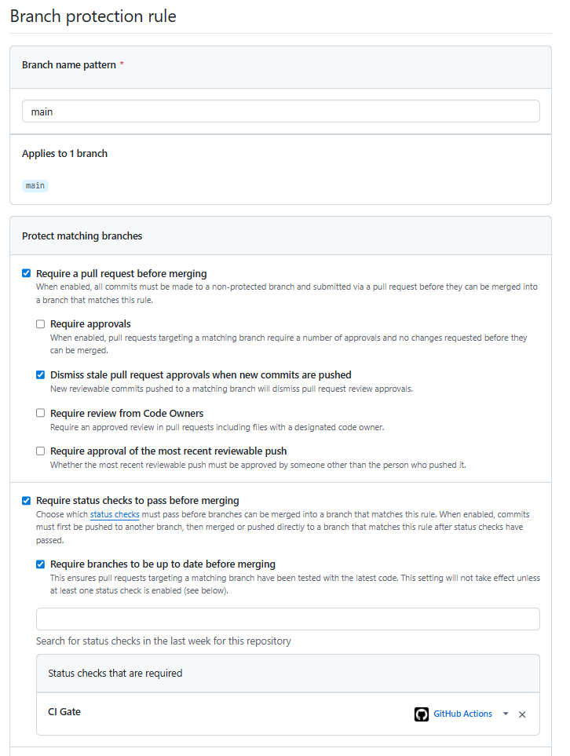

# CI/CD

## Proteção de Branch

Todos os repositórios possuem proteção de branch configurada. Não é possível fazer push direto na main, toda alteração precisa ser feita por Pull Request a partir de outra branch.

A aprovação e o merge de um Pull Request só são permitidos caso a pipeline de CI (`pr-validation.yaml`) seja executada com sucesso.



## Integração Contínua (CI)

Cada repositório possui uma pipeline `pr-validation.yaml` em `.github/workflows/` que é executada automaticamente em Pull Requests para a branch `main`.

### Estrutura comum

Todos os repositórios de aplicação (.NET) seguem a mesma estrutura:

1. **Build** do projeto (.NET 10.0, Release)
2. **Testes** com coleta de cobertura (OpenCover via coverlet)
3. **Publicação do relatório de testes** via `dorny/test-reporter`
4. **Validação de cobertura mínima de 80%**
5. **CI Gate** como job final

A fase 5 não utiliza SonarCloud nas pipelines. A análise de qualidade é feita localmente e pela validação de cobertura mínima na CI.

### CI Gate

O `ci-gate` é um job que agrega todos os resultados anteriores. A proteção de branch exige que o `ci-gate` passe antes de permitir o merge do PR.

```yaml
ci-gate:
    name: CI Gate
    runs-on: ubuntu-latest
    needs: [build-test]
    if: always()
    steps:
      - name: Verificar resultados
        run: |
          if [ "${{ needs.build-test.result }}" != "success" ]; then
            echo "❌ CI Gate falhou: build-test=${{ needs.build-test.result }}"
            exit 1
          fi
          echo "✅ CI Gate aprovado"
```

### Validação de cobertura ≥ 80%

A validação de cobertura é feita por um script bash que extrai a porcentagem de cobertura do relatório OpenCover e falha a pipeline caso esteja abaixo de 80%:

```yaml
- name: Validar Cobertura Mínima (80%)
  run: |
    COVERAGE_FILE=$(find . -type f -name "coverage.opencover.xml" -print -quit)
    LINE_RATE=$(grep -oP 'sequenceCoverage="\K[^"]+' "$COVERAGE_FILE" | head -1)
    echo "Cobertura de código: ${LINE_RATE}%"
    PASS=$(python3 -c "print('true' if float('${LINE_RATE}') >= 80.0 else 'false')")
    if [ "$PASS" = "false" ]; then
      echo "❌ Cobertura abaixo do mínimo: ${LINE_RATE}% (mínimo: 80%)"
      exit 1
    fi
```

### Pipelines por repositório

#### Upload
- CI: [pr-validation.yaml](https://github.com/joaosena19/fiap-12soat-projeto-fase-5-upload/blob/main/.github/workflows/pr-validation.yaml)
- CD: [deploy.yaml](https://github.com/joaosena19/fiap-12soat-projeto-fase-5-upload/blob/main/.github/workflows/deploy.yaml)
- Build .NET 10.0, testes, publicação Docker, provisionamento RDS PostgreSQL via Terraform, deploy ClamAV + Upload no EKS.

#### Processamento
- CI: [pr-validation.yaml](https://github.com/joaosena19/fiap-12soat-projeto-fase-5-processamento/blob/main/.github/workflows/pr-validation.yaml)
- CD: [deploy.yaml](https://github.com/joaosena19/fiap-12soat-projeto-fase-5-processamento/blob/main/.github/workflows/deploy.yaml)
- Build .NET 10.0, testes, publicação Docker, provisionamento RDS PostgreSQL via Terraform, deploy no EKS.

#### Relatório
- CI: [pr-validation.yaml](https://github.com/joaosena19/fiap-12soat-projeto-fase-5-relatorio/blob/main/.github/workflows/pr-validation.yaml)
- CD: [deploy.yaml](https://github.com/joaosena19/fiap-12soat-projeto-fase-5-relatorio/blob/main/.github/workflows/deploy.yaml)
- Build .NET 10.0, testes, publicação Docker, provisionamento RDS PostgreSQL via Terraform, deploy no EKS.

#### Infraestrutura
- CI: [pr-validation.yaml](https://github.com/joaosena19/fiap-12soat-projeto-fase-5-infra/blob/main/.github/workflows/pr-validation.yaml)
- CD: [deploy.yaml](https://github.com/joaosena19/fiap-12soat-projeto-fase-5-infra/blob/main/.github/workflows/deploy.yaml)
- CI valida Terraform (`terraform init` + `terraform validate`). CD provisiona EKS, VPC, IAM, SNS/SQS, New Relic via Terraform.

## Deploy Contínuo (CD)

Os deploys são realizados via `workflow_dispatch` (gatilho manual no GitHub Actions). A automação do processo é completa, mas o gatilho é manual para evitar deploys prematuros durante o desenvolvimento.

### Estrutura do deploy

Todos os serviços de aplicação (.NET) seguem a mesma pipeline de deploy em 3 estágios:

1. **Build e Teste** — Build Release e execução dos testes
2. **Publicação** (em paralelo):
   - **2a. Docker Image** — Build e push da imagem para Docker Hub com tag versionada (`v{YYYYMMDD-HHMMSS}-{SHA}`)
   - **2b. Database** — Provisionamento do banco PostgreSQL via Terraform (state armazenado em S3)
3. **Deploy no EKS** — Configuração do cluster, criação de Secrets e ConfigMaps com dados do Terraform, atualização da imagem no manifesto K8s, apply dos manifests e validação do rollout

### Configuração no cluster

O deploy injeta automaticamente no Kubernetes:

- **Secrets**: credenciais de banco, JWT key, credenciais AWS, licença New Relic, e para o Processamento também a API key do LLM
- **ConfigMap**: connection strings, configurações de mensageria (tópicos SNS/SQS), New Relic (app name, distributed tracing, profiler), e configurações específicas de cada serviço (ClamAV para Upload, LLM para Processamento)

A tag da imagem Docker é atualizada diretamente no manifesto de deployment antes do `kubectl apply`.

---
Anterior: [Segurança](../07%20-%20Segurança/1_seguranca.md)  
Próximo: [Plano de monitoramento](../09%20-%20Plano%20de%20Monitoramento/1_plano_de_monitoramento.md)
