# Plano de monitoramento

## New Relic

O New Relic é a ferramenta de monitoramento do projeto. A configuração é feita via variáveis de ambiente no ConfigMap do Kubernetes, incluindo distributed tracing, profiler .NET e envio de logs estruturados.

## Log estruturado na aplicação

A aplicação utiliza a interface `IAppLogger` (abstração sobre o `ILogger` do .NET) para registrar logs estruturados via Serilog. Cada use case está dentro de uma lógica de try/catch que captura `DomainException` (regras de negócio) e `Exception` (erros inesperados), logando com contexto enriquecido.

### Interface `IAppLogger` e implementação

A interface `IAppLogger` expõe os métodos de log e um método `ComPropriedade` que retorna um novo `IAppLogger` com contexto adicional:

```csharp
public interface IAppLogger
{
    void LogDebug(string messageTemplate, params object[] args);
    void LogInformation(string messageTemplate, params object[] args);
    void LogWarning(string messageTemplate, params object[] args);
    void LogWarning(Exception ex, string messageTemplate, params object[] args);
    void LogError(string messageTemplate, params object[] args);
    void LogError(Exception ex, string messageTemplate, params object[] args);
    IAppLogger ComPropriedade(string key, object? value);
}
```

A implementação `LoggerAdapter<T>` delega para o `ILogger<T>` do .NET e adiciona o `message_template` como propriedade Serilog a cada chamada. Quando `ComPropriedade` é chamado, um `ContextualLogger` é criado — ele acumula propriedades em um dicionário e as empurra para o `LogContext` do Serilog antes de cada chamada de log:

```csharp
public IAppLogger ComPropriedade(string key, object? value)
{
    var context = new Dictionary<string, object?> { [key] = value };
    return new ContextualLogger(this, context);
}
```

```csharp
private void ExecutarComContexto(Action logAction)
{
    var disposables = new List<IDisposable>();

    foreach (var kvp in _context)
        if (kvp.Value != null)
            disposables.Add(LogContext.PushProperty(kvp.Key, kvp.Value));

    try { logAction(); }
    finally
    {
        foreach (var disposable in disposables)
            disposable.Dispose();
    }
}
```

### Extensões fluentes (`LoggerExtensions`)

Extensões semânticas encapsulam os nomes das propriedades (definidos em `LogNomesPropriedades`), evitando strings hardcoded no código da aplicação:

```csharp
public static IAppLogger ComUseCase(this IAppLogger logger, object useCase)
{
    var useCaseName = useCase.GetType().Name;
    return logger.ComPropriedade(LogNomesPropriedades.UseCase, useCaseName);
}

public static IAppLogger ComEnvioMensagem(this IAppLogger logger, object mensageria)
{
    var nomeMensageria = mensageria.GetType().Name;
    return logger.ComPropriedade(LogNomesPropriedades.Mensageria, nomeMensageria)
                 .ComPropriedade(LogNomesPropriedades.TipoMensageria, TipoMensageriaNome_Envio);
}

public static IAppLogger ComConsumoMensagem(this IAppLogger logger, object mensageria)
{
    var nomeMensageria = mensageria.GetType().Name;
    return logger.ComPropriedade(LogNomesPropriedades.Mensageria, nomeMensageria)
                 .ComPropriedade(LogNomesPropriedades.TipoMensageria, TipoMensageriaNome_Consumo);
}

public static IAppLogger ComDomainErrorType(this IAppLogger logger, DomainException ex)
{
    return logger.ComPropriedade(LogNomesPropriedades.DomainErrorType, ex.ErrorType);
}
```

### Padrão try/catch nos use cases

Cada use case segue o mesmo padrão: log fluente com propriedades contextuais, captura de `DomainException` (logado como Information) e `Exception` genérica (logado como Error):

```csharp
public async Task ExecutarAsync([... parâmetros do caso de uso ...])
{
    try
    {
        logger.ComUseCase(this)
              .ComPropriedade(LogNomesPropriedades.AnaliseDiagramaId, analiseDiagramaId)
              .LogDebug("Iniciando processamento do diagrama {AnaliseDiagramaId}", analiseDiagramaId);

        [... lógica do caso de uso ...]
    }
    catch (DomainException ex)
    {
        logger.ComUseCase(this)
              .ComPropriedade(LogNomesPropriedades.AnaliseDiagramaId, analiseDiagramaId)
              .ComDomainErrorType(ex)
              .LogInformation(ex.LogTemplate, ex.LogArgs);

        presenter.ApresentarErro(ex.Message, ex.ErrorType);
    }
    catch (Exception ex)
    {
        logger.ComUseCase(this)
              .ComPropriedade(LogNomesPropriedades.AnaliseDiagramaId, analiseDiagramaId)
              .LogError(ex, "Erro interno do servidor ao processar upload.");

        presenter.ApresentarErro("Erro interno do servidor.", ErrorType.UnexpectedError);
    }
}
```

### Logging nos consumers de mensageria

Os consumers de mensageria usam as extensões `ComConsumoMensagem` e enriquecem cada log com `AnaliseDiagramaId` e `MessageId`, garantindo rastreabilidade completa do pipeline:

```csharp
public async Task Consume(ConsumeContext<UploadDiagramaConcluidoDto> context)
{
    var mensagem = context.Message;
    var logger = _loggerFactory.CriarAppLogger<UploadDiagramaConcluidoConsumer>();

    try
    {
        var messageId = context.MessageId?.ToString() ?? LogNomesValores.Desconhecido;

        logger.ComConsumoMensagem(this)
              .ComPropriedade(LogNomesPropriedades.AnaliseDiagramaId, mensagem.AnaliseDiagramaId)
              .ComPropriedade(LogNomesPropriedades.MessageId, messageId)
              .LogInformation("Recebida mensagem de upload concluído para processamento. {MessageId}", messageId);

        [... lógica de consumo ...]
    }
    catch (Exception ex)
    {
        logger.ComConsumoMensagem(this)
              .ComPropriedade(LogNomesPropriedades.AnaliseDiagramaId, mensagem.AnaliseDiagramaId)
              .LogError(ex, "Erro ao consumir mensagem de upload concluído");
        throw;
    }
}
```

### Constantes de propriedades (`LogNomesPropriedades`)

As propriedades de log são centralizadas em constantes, garantindo consistência entre os 3 serviços e permitindo correlação nas queries NRQL do dashboard:

```csharp
public static class LogNomesPropriedades
{
    public const string CorrelationId = "CorrelationId";
    public const string UseCase = "UseCase";
    public const string Mensageria = "Mensageria";
    public const string TipoMensageria = "TipoMensageria";
    public const string DomainErrorType = "DomainErrorType";
    public const string AnaliseDiagramaId = "AnaliseDiagramaId";
    public const string MessageId = "MessageId";
    public const string DuracaoMs = "DuracaoMs";
    [...]
}
```

As queries do dashboard exploram diretamente estas propriedades — por exemplo, o widget **Logs de erro** filtra por `UseCase`, `Mensageria` e `AnaliseDiagramaId`, e o widget **Erros de domínio / use case** agrupa por `DomainErrorType`.

## CorrelationId

O `CorrelationId` é o identificador que conecta todos os logs e eventos de uma mesma requisição, mesmo entre serviços diferentes. Ele é gerado na entrada do pipeline (upload via HTTP) e propagado automaticamente para os serviços de processamento e relatório via MassTransit.

### Middleware HTTP

O `CorrelationIdMiddleware` intercepta toda requisição HTTP. Se o header `X-Correlation-ID` não existir, ele gera um novo GUID. Em seguida, empurra o valor para o `CorrelationContext` (AsyncLocal thread-safe) e para o `LogContext` do Serilog, garantindo que todos os logs daquela requisição sejam enriquecidos automaticamente:

```csharp
public async Task InvokeAsync(HttpContext context)
{
    var headerValue = context.Request.Headers[CorrelationConstants.HeaderName].FirstOrDefault();

    string correlationId;
    if (string.IsNullOrWhiteSpace(headerValue))
        correlationId = Guid.NewGuid().ToString();
    else
        correlationId = headerValue;

    context.Response.OnStarting(() =>
    {
        context.Response.Headers[CorrelationConstants.HeaderName] = correlationId;
        return Task.CompletedTask;
    });

    using (CorrelationContext.Push(correlationId))
    using (LogContext.PushProperty(CorrelationConstants.LogPropertyName, correlationId))
        await _next(context);
}
```

### Propagação via MassTransit (filtros)

Três filtros MassTransit garantem que o `CorrelationId` acompanhe as mensagens entre serviços:

| Filtro | Direção | Responsabilidade |
|--------|---------|------------------|
| `PublishCorrelationIdFilter<T>` | Saída (Publish) | Lê o `CorrelationContext.Current` e injeta no header da mensagem |
| `SendCorrelationIdFilter<T>` | Saída (Send) | Mesma lógica, para envios diretos (send) |
| `ConsumeCorrelationIdFilter<T>` | Entrada (Consume) | Extrai o `CorrelationId` do header da mensagem e reestabelece o `CorrelationContext` + `LogContext` |

Os filtros de saída delegam para um helper compartilhado:

```csharp
public static void AplicarCorrelationId<T>(SendContext<T> context) where T : class
{
    var correlationId = CorrelationContext.Current ?? Guid.NewGuid().ToString();
    context.Headers.Set(CorrelationConstants.HeaderName, correlationId);

    if (Guid.TryParse(correlationId, out var guid))
        context.CorrelationId = guid;
}
```

O filtro de consumo extrai o `CorrelationId` do header da mensagem, do `CorrelationId` nativo do MassTransit, ou de uma propriedade `CorrelationId` no corpo da mensagem (nessa ordem de prioridade), e reestabelece o escopo:

```csharp
public async Task Send(ConsumeContext<T> context, IPipe<ConsumeContext<T>> next)
{
    var correlationId = ExtractCorrelationId(context);

    using (CorrelationContext.Push(correlationId))
    using (LogContext.PushProperty(CorrelationConstants.LogPropertyName, correlationId))
        await next.Send(context);
}
```

### `CorrelationIdEnricher` (Serilog)

O `CorrelationIdEnricher` é registrado globalmente no pipeline do Serilog. Ele garante que mesmo logs gerados fora do escopo do middleware (ex: background jobs) ainda recebam o `CorrelationId` do `CorrelationContext`:

```csharp
public class CorrelationIdEnricher : ILogEventEnricher
{
    public void Enrich(LogEvent logEvent, ILogEventPropertyFactory propertyFactory)
    {
        if (logEvent.Properties.ContainsKey(CorrelationConstants.LogPropertyName))
            return;

        var correlationId = CorrelationContext.Current;

        if (!string.IsNullOrEmpty(correlationId))
        {
            var property = new LogEventProperty(CorrelationConstants.LogPropertyName, new ScalarValue(correlationId));
            logEvent.AddPropertyIfAbsent(property);
        }
    }
}
```

### `ICorrelationIdAccessor`

A interface `ICorrelationIdAccessor` permite que a camada de Application (que não conhece infraestrutura) acesse o `CorrelationId` atual para incluí-lo em custom events do New Relic:

```csharp
public class CorrelationIdAccessor : ICorrelationIdAccessor
{
    public string GetCorrelationId()
    {
        var current = CorrelationContext.Current;
        if (!string.IsNullOrWhiteSpace(current))
            return current;

        return Guid.NewGuid().ToString();
    }
}
```

### Fluxo de propagação

O diagrama abaixo ilustra o caminho do `CorrelationId` desde a requisição HTTP até o último serviço do pipeline:

```
  HTTP Request
       │
       ▼
┌──────────────────────────────┐
│   CorrelationIdMiddleware    │  ← Gera ou lê X-Correlation-ID
│   CorrelationContext.Push()  │
│   LogContext.PushProperty()  │
└──────────┬───────────────────┘
           │
           ▼
┌──────────────────────────────┐
│     Upload (Use Case)        │  ← Logs já contêm CorrelationId
│     IAppLogger.ComUseCase()  │
└──────────┬───────────────────┘
           │ MassTransit Publish
           ▼
┌──────────────────────────────┐
│  PublishCorrelationIdFilter  │  ← Injeta CorrelationId no header
└──────────┬───────────────────┘
           │ SQS / RabbitMQ
           ▼
┌──────────────────────────────┐
│  ConsumeCorrelationIdFilter  │  ← Extrai header → CorrelationContext
│  CorrelationContext.Push()   │
│  LogContext.PushProperty()   │
└──────────┬───────────────────┘
           │
           ▼
┌──────────────────────────────┐
│  Processamento (Consumer)    │  ← Logs com mesmo CorrelationId
│  IAppLogger.ComConsumo...()  │
└──────────┬───────────────────┘
           │ MassTransit Publish
           ▼
┌──────────────────────────────┐
│  PublishCorrelationIdFilter  │  ← Propaga novamente
└──────────┬───────────────────┘
           │
           ▼
┌──────────────────────────────┐
│  ConsumeCorrelationIdFilter  │
└──────────┬───────────────────┘
           │
           ▼
┌──────────────────────────────┐
│    Relatório (Consumer)      │  ← Mesmo CorrelationId do upload
│    IAppLogger.ComConsumo.()  │
└──────────────────────────────┘
```

Uma busca por `CorrelationId` no New Relic retorna todos os logs de todos os serviços envolvidos naquela operação, do upload até a geração do relatório.

## Custom events para o pipeline

O pipeline Upload → Processamento → Relatório é monitorado através de **custom events do New Relic**, registrados pela implementação `NewRelicMetricsService` (interface `IMetricsService`). Cada evento é enviado via `NewRelic.RecordCustomEvent()` com atributos contextuais incluindo `appName`, `CorrelationId` e `AnaliseDiagramaId`.

### Eventos de Upload

| Evento | Quando é disparado | Atributos |
|--------|-------------------|-----------|
| `UploadDiagramaRecebido` | Requisição de upload recebida | `AnaliseDiagramaId`, `CorrelationId` |
| `UploadDiagramaAceito` | Upload validado e aceito (segurança OK) | `AnaliseDiagramaId`, `CorrelationId` |
| `UploadDiagramaRejeitado` | Upload rejeitado por falha de segurança (malware, tipo inválido) | `AnaliseDiagramaId`, `Motivo`, `CorrelationId` |
| `UploadDiagramaComFalha` | Erro interno durante o upload | `AnaliseDiagramaId`, `OrigemErro`, `CorrelationId` |
| `TentativaUploadRepetida` | Tentativa de upload duplicado para mesmo diagrama | `AnaliseDiagramaId`, `Tentativas`, `CorrelationId` |

### Eventos de Processamento

| Evento | Quando é disparado | Atributos |
|--------|-------------------|-----------|
| `ProcessamentoDiagramaIniciado` | Processamento do diagrama iniciado | `AnaliseDiagramaId`, `CorrelationId` |
| `ProcessamentoDiagramaConcluido` | LLM concluiu a análise com sucesso | `AnaliseDiagramaId`, `DuracaoMs`, `CorrelationId` |
| `ProcessamentoDiagramaFalha` | Erro na chamada ao LLM ou processamento | `AnaliseDiagramaId`, `OrigemErro`, `CorrelationId` |
| `ProcessamentoDiagramaRejeitado` | LLM retornou resposta inválida (validação falhou) | `AnaliseDiagramaId`, `OrigemRejeicao`, `CorrelationId` |

### Eventos de Relatório

| Evento | Quando é disparado | Atributos |
|--------|-------------------|-----------|
| `AnaliseDiagramaRecebida` | Resultado de análise recebido pelo serviço de Relatório | `AnaliseDiagramaId`, `CorrelationId` |
| `AnaliseDiagramaConcluida` | Análise persistida com sucesso no banco | `AnaliseDiagramaId`, `CorrelationId` |
| `FalhaProcessamentoRecebida` | Mensagem de falha recebida do Processamento | `AnaliseDiagramaId`, `CorrelationId` |
| `RejeicaoProcessamentoRecebida` | Mensagem de rejeição recebida do Processamento | `AnaliseDiagramaId`, `CorrelationId` |
| `RejeicaoUploadRecebida` | Mensagem de rejeição recebida do Upload | `AnaliseDiagramaId`, `CorrelationId` |
| `RelatorioGerado` | Relatório gerado com sucesso (PDF, Markdown ou JSON) | `AnaliseDiagramaId`, `TipoRelatorio`, `CorrelationId` |
| `RelatorioComFalha` | Erro ao gerar relatório | `AnaliseDiagramaId`, `CorrelationId` |

## Dashboard New Relic

### Dashboard completo

O dashboard possui duas variáveis seletoras: **Serviço** (filtra por aplicação) e **AnaliseDiagramaId** (filtra por um diagrama específico).

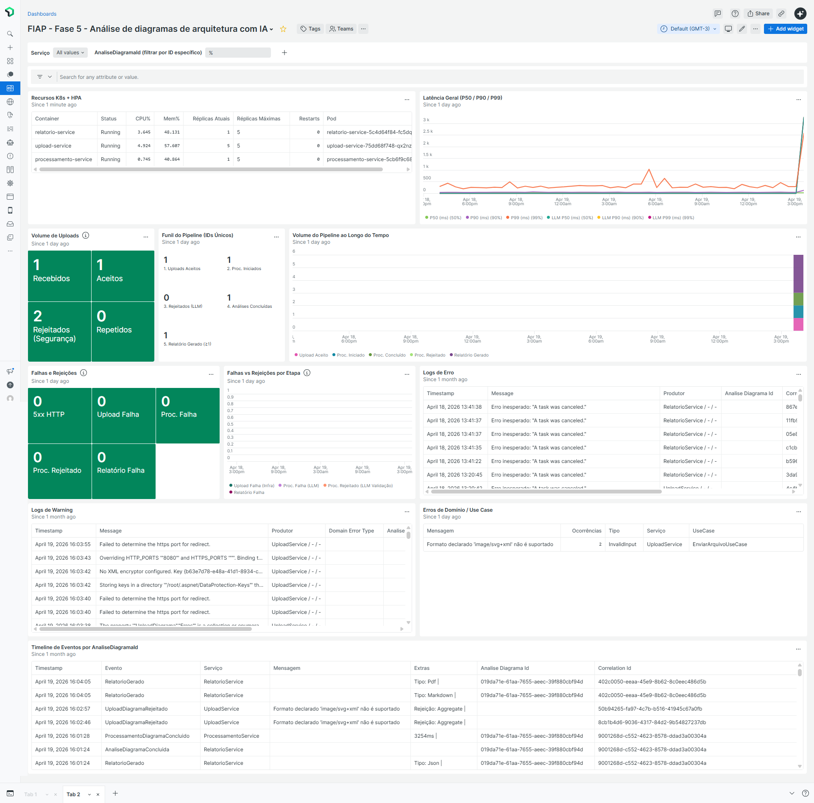

### Variáveis e filtros

- **Serviço** (`{{servico}}`): permite escolher entre `UploadService`, `ProcessamentoService` e `RelatorioService`
- **AnaliseDiagramaId** (`{{analiseDiagramaId}}`): campo texto para filtrar por um diagrama específico

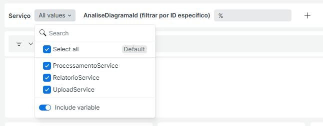

### Widgets

**Recursos K8s + HPA**

Tabela consolidada que exibe, para cada container (`upload-service`, `processamento-service`, `relatorio-service`), o status, consumo percentual de CPU e Memória, réplicas ativas, limite HPA e contagem de restarts. Possui thresholds de warning (70%) e critical (90%) para CPU e Memória, e alerta de restarts.

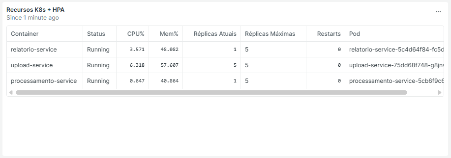

```sql
SELECT
    latest(status) AS 'Status',
    (max(cpuUsedCores) / max(cpuLimitCores)) * 100 AS 'CPU%',
    (max(memoryWorkingSetBytes) / max(memoryLimitBytes)) * 100 AS 'Mem%',
    uniqueCount(podName) AS 'Réplicas Atuais',
    5 AS 'Réplicas Máximas',
    sum(restartCount) AS 'Restarts',
    latest(podName) AS 'Pod'
FROM K8sContainerSample
WHERE containerName IN ('upload-service', 'processamento-service', 'relatorio-service')
  AND status = 'Running'
FACET containerName AS 'Container'
SINCE 1 minute ago
```

**Latência geral (P50 / P90 / P99)**

Gráfico de linhas com os percentis de latência das transações HTTP e do tempo de processamento LLM. Mostra duas séries: latência das APIs (Transaction) e latência das chamadas ao LLM (`ProcessamentoDiagramaConcluido.DuracaoMs`).

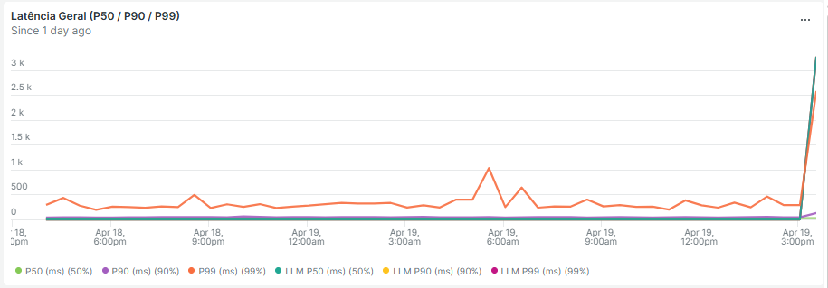

```sql
SELECT
    percentile(duration, 50) * 1000 AS 'P50 (ms)',
    percentile(duration, 90) * 1000 AS 'P90 (ms)',
    percentile(duration, 99) * 1000 AS 'P99 (ms)'
FROM Transaction
WHERE appName IN ({{servico}})
SINCE 1 day ago
TIMESERIES AUTO
```

```sql
SELECT
    percentile(DuracaoMs, 50) AS 'LLM P50 (ms)',
    percentile(DuracaoMs, 90) AS 'LLM P90 (ms)',
    percentile(DuracaoMs, 99) AS 'LLM P99 (ms)'
FROM ProcessamentoDiagramaConcluido
WHERE appName IN ({{servico}})
SINCE 1 day ago
TIMESERIES AUTO
```

**Volume de uploads**

Billboard com contadores de uploads recebidos, aceitos, rejeitados por segurança e repetidos. Thresholds de warning e critical para rejeições de segurança.

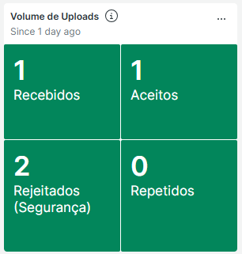

```sql
SELECT count(*) AS 'Recebidos'
FROM UploadDiagramaRecebido
WHERE appName IN ({{servico}})
SINCE 1 day ago
```

```sql
SELECT count(*) AS 'Aceitos'
FROM UploadDiagramaAceito
WHERE appName IN ({{servico}})
SINCE 1 day ago
```

```sql
SELECT count(*) AS 'Rejeitados (Segurança)'
FROM UploadDiagramaRejeitado
WHERE appName IN ({{servico}})
SINCE 1 day ago
```

```sql
SELECT count(*) AS 'Repetidos'
FROM TentativaUploadRepetida
WHERE appName IN ({{servico}})
SINCE 1 day ago
```

**Funil do pipeline (IDs únicos)**

Billboard que mostra o funil de conversão do pipeline por IDs únicos de `AnaliseDiagramaId`: uploads aceitos → processamentos iniciados → rejeitados pelo LLM → análises concluídas → relatórios gerados. Permite identificar onde o pipeline está perdendo diagramas.

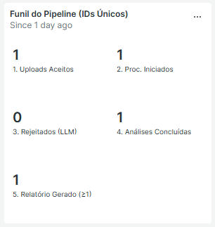

```sql
SELECT
    filter(uniqueCount(AnaliseDiagramaId), WHERE eventType() = 'UploadDiagramaAceito')        AS '1. Uploads Aceitos',
    filter(uniqueCount(AnaliseDiagramaId), WHERE eventType() = 'ProcessamentoDiagramaIniciado') AS '2. Proc. Iniciados',
    filter(uniqueCount(AnaliseDiagramaId), WHERE eventType() = 'ProcessamentoDiagramaRejeitado') AS '3. Rejeitados (LLM)',
    filter(uniqueCount(AnaliseDiagramaId), WHERE eventType() = 'AnaliseDiagramaConcluida')      AS '4. Análises Concluídas',
    filter(uniqueCount(AnaliseDiagramaId), WHERE eventType() = 'RelatorioGerado')               AS '5. Relatório Gerado (≥1)'
FROM UploadDiagramaAceito, ProcessamentoDiagramaIniciado, ProcessamentoDiagramaRejeitado, AnaliseDiagramaConcluida, RelatorioGerado
WHERE appName IN ({{servico}})
SINCE 1 day ago
```

**Volume do pipeline ao longo do tempo**

Gráfico de barras empilhadas que mostra o volume de eventos do pipeline ao longo do tempo: uploads aceitos, processamentos iniciados, concluídos, rejeitados e relatórios gerados.

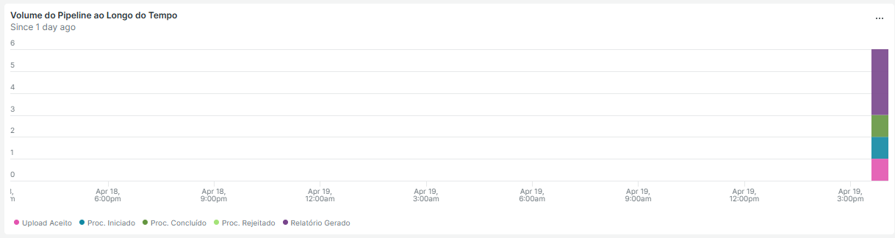

```sql
SELECT
    filter(count(*), WHERE eventType() = 'UploadDiagramaAceito')              AS 'Upload Aceito',
    filter(count(*), WHERE eventType() = 'ProcessamentoDiagramaIniciado')     AS 'Proc. Iniciado',
    filter(count(*), WHERE eventType() = 'ProcessamentoDiagramaConcluido')    AS 'Proc. Concluído',
    filter(count(*), WHERE eventType() = 'ProcessamentoDiagramaRejeitado')    AS 'Proc. Rejeitado',
    filter(count(*), WHERE eventType() = 'RelatorioGerado')                   AS 'Relatório Gerado'
FROM UploadDiagramaAceito, ProcessamentoDiagramaIniciado, ProcessamentoDiagramaConcluido, ProcessamentoDiagramaRejeitado, RelatorioGerado
WHERE appName IN ({{servico}})
SINCE 1 day ago
TIMESERIES AUTO
```

**Falhas e rejeições**

Billboard consolidado que contabiliza erros HTTP 5xx, falhas de upload, falhas de processamento, rejeições do LLM e falhas de relatório. Thresholds de warning e critical para cada tipo.

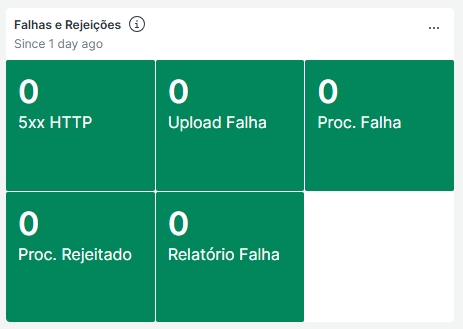

```sql
SELECT count(*) AS '5xx HTTP'
FROM Transaction
WHERE (httpResponseCode LIKE '5%' OR http.statusCode >= 500)
  AND appName IN ({{servico}})
SINCE 1 day ago
```

```sql
SELECT count(*) AS 'Upload Falha'
FROM UploadDiagramaComFalha
WHERE appName IN ({{servico}})
SINCE 1 day ago
```

```sql
SELECT count(*) AS 'Proc. Falha'
FROM ProcessamentoDiagramaFalha
WHERE appName IN ({{servico}})
SINCE 1 day ago
```

```sql
SELECT count(*) AS 'Proc. Rejeitado'
FROM ProcessamentoDiagramaRejeitado
WHERE appName IN ({{servico}})
SINCE 1 day ago
```

```sql
SELECT count(*) AS 'Relatório Falha'
FROM RelatorioComFalha
WHERE appName IN ({{servico}})
SINCE 1 day ago
```

**Falhas vs rejeições por etapa**

Gráfico de barras empilhadas que separa falhas (erros de infraestrutura) de rejeições (validação do LLM) ao longo do tempo, permitindo identificar se os problemas são de infra ou de qualidade das respostas do LLM.

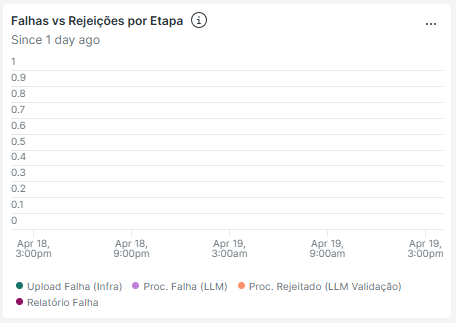

```sql
SELECT
    filter(count(*), WHERE eventType() = 'UploadDiagramaComFalha')          AS 'Upload Falha (Infra)',
    filter(count(*), WHERE eventType() = 'ProcessamentoDiagramaFalha')       AS 'Proc. Falha (LLM)',
    filter(count(*), WHERE eventType() = 'ProcessamentoDiagramaRejeitado')   AS 'Proc. Rejeitado (LLM Validação)',
    filter(count(*), WHERE eventType() = 'RelatorioComFalha')                AS 'Relatório Falha'
FROM UploadDiagramaComFalha, ProcessamentoDiagramaFalha, ProcessamentoDiagramaRejeitado, RelatorioComFalha
WHERE appName IN ({{servico}})
SINCE 1 day ago
TIMESERIES AUTO
```

**Logs de erro**

Tabela com os últimos 100 logs de nível Error, exibindo timestamp, mensagem, produtor (aplicação / UseCase / Mensageria), `AnaliseDiagramaId`, `CorrelationId` e `trace.id`.

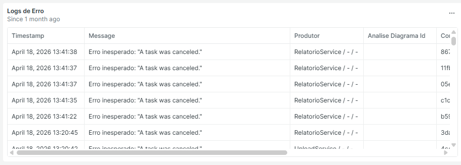

```sql
SELECT
    timestamp,
    message,
    concat(
        if(application IS NULL, '-', application), ' / ',
        if(UseCase IS NULL, '-', UseCase), ' / ',
        if(Mensageria IS NULL, '-', Mensageria)
    ) AS 'Produtor',
    AnaliseDiagramaId,
    CorrelationId,
    trace.id
FROM Log
WHERE level IN ('Error', 'ERROR', 'error', '4', 4)
  AND application IN ({{servico}})
ORDER BY timestamp DESC
SINCE 30 days ago
LIMIT 100
```

**Logs de warning**

Tabela semelhante aos logs de erro, mas para nível Warning. Inclui também `DomainErrorType` para identificar erros de domínio tratados.

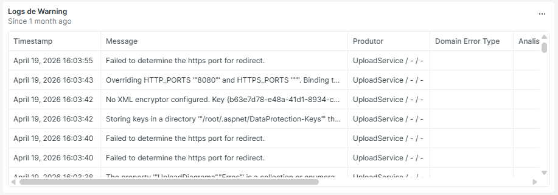

```sql
SELECT
    timestamp,
    message,
    concat(
        if(application IS NULL, '-', application), ' / ',
        if(UseCase IS NULL, '-', UseCase), ' / ',
        if(Mensageria IS NULL, '-', Mensageria)
    ) AS 'Produtor',
    DomainErrorType,
    AnaliseDiagramaId,
    CorrelationId,
    trace.id
FROM Log
WHERE level IN ('Warning', 'WARNING', 'warning', 'Warn', 'WARN', '3', 3)
  AND application IN ({{servico}})
ORDER BY timestamp DESC
SINCE 30 days ago
LIMIT 100
```

**Erros de domínio / use case**

Tabela agrupada por mensagem, mostrando ocorrências de erros de domínio com `DomainErrorType`, serviço e use case de origem. Filtra logs de Warning e Information que possuem `DomainErrorType`.

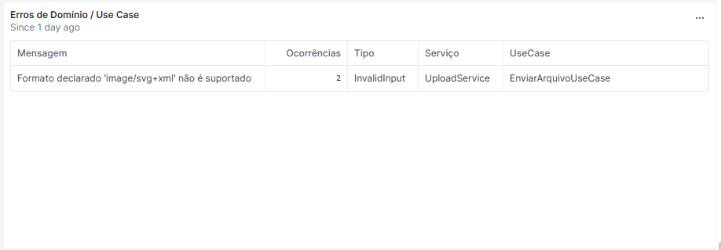

```sql
SELECT
    count(*) AS 'Ocorrências',
    latest(DomainErrorType) AS 'Tipo',
    latest(application) AS 'Serviço',
    latest(UseCase) AS 'UseCase'
FROM Log
WHERE level IN ('Warning', 'WARNING', 'warning', 'Warn', 'WARN', '3', 3,
                'Information', 'INFORMATION', 'information', '2', 2)
  AND DomainErrorType IS NOT NULL
  AND application IN ({{servico}})
FACET message AS 'Mensagem'
SINCE 1 day ago
LIMIT 50
```

**Timeline de eventos por AnaliseDiagramaId**

Tabela que exibe **todos** os 16 custom events do pipeline em ordem cronológica, filtráveis por `AnaliseDiagramaId`. Para cada evento mostra timestamp, tipo, serviço, mensagem e extras (origem do erro, tipo de rejeição, tipo de relatório, duração, tentativas). É o widget mais útil para rastrear o ciclo de vida completo de uma análise.

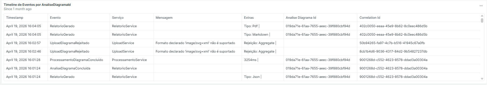

```sql
SELECT
    timestamp,
    eventType() AS 'Evento',
    appName AS 'Serviço',
    Motivo AS 'Mensagem',
    concat(
        if(OrigemErro IS NOT NULL,     concat('Origem: ',   OrigemErro,     ' | '), ''),
        if(OrigemRejeicao IS NOT NULL, concat('Rejeição: ', OrigemRejeicao, ' | '), ''),
        if(TipoRelatorio IS NOT NULL,  concat('Tipo: ',     TipoRelatorio,  ' | '), ''),
        if(DuracaoMs IS NOT NULL,      concat(DuracaoMs, 'ms | '),                  ''),
        if(Tentativas IS NOT NULL,     concat(Tentativas, ' tent.'),                '')
    ) AS 'Extras',
    AnaliseDiagramaId,
    CorrelationId
FROM
    UploadDiagramaRecebido, UploadDiagramaAceito, UploadDiagramaRejeitado,
    UploadDiagramaComFalha, TentativaUploadRepetida,
    ProcessamentoDiagramaIniciado, ProcessamentoDiagramaConcluido,
    ProcessamentoDiagramaFalha, ProcessamentoDiagramaRejeitado,
    AnaliseDiagramaRecebida, AnaliseDiagramaConcluida,
    FalhaProcessamentoRecebida, RejeicaoProcessamentoRecebida, RejeicaoUploadRecebida,
    RelatorioGerado, RelatorioComFalha
WHERE ({{analiseDiagramaId}} = '%' OR AnaliseDiagramaId = {{analiseDiagramaId}})
  AND appName IN ({{servico}})
ORDER BY timestamp DESC
SINCE 30 days ago
LIMIT 200
```

---
Anterior: [CI/CD](../08%20-%20CI%20%26%20CD/1_ci_cd.md)  
Próximo: [Qualidade - Upload](../10%20-%20Testes%20e%20qualidade/1_qualidade_upload.md)
