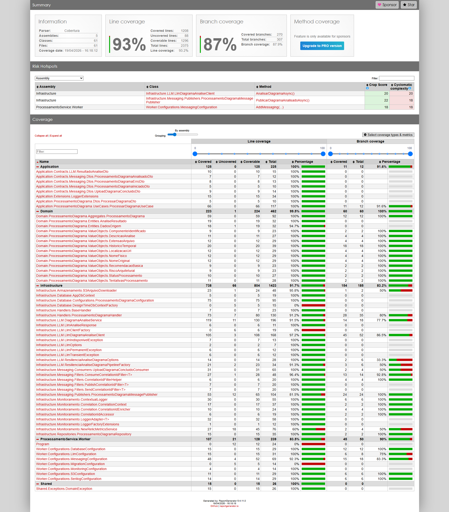

# Qualidade - Processamento

## Frameworks de Teste
- **xUnit** 2.9.3 (framework de testes)
- **Moq** 4.20.72 (mocking)
- **Shouldly** 4.2.1 (asserções fluentes)
- **coverlet** 6.0.4 (cobertura de código)
- **Microsoft.Extensions.AI** 10.4.1 (mocking de serviços LLM)
- **Microsoft.EntityFrameworkCore.InMemory** 9.0.4 (banco in-memory para testes)

## Test Coverage

Veja o [relatório completo de cobertura](test_coverage_processamento_completo.zip) (download do HTML).

O projeto de Processamento possui 36 arquivos de teste, cobrindo testes unitários de domínio (aggregates, value objects), application (use cases, handlers), infrastructure (repositórios, armazenamento S3, messaging, monitoramento) e configurações do worker.

## Proteção de Branch

A branch `main` está protegida contra push direto. Toda alteração precisa ser feita via Pull Request, e o CI Gate deve passar com sucesso antes do merge.

---
Anterior: [Qualidade - Upload](1_qualidade_upload.md)  
Próximo: [Qualidade - Relatório](3_qualidade_relatorio.md)
