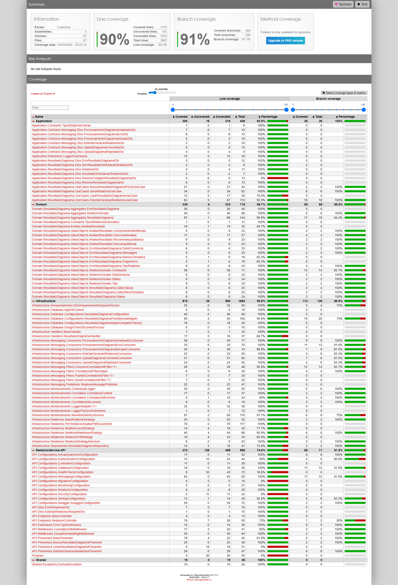

# Qualidade - Relatório

## Frameworks de Teste
- **xUnit** 2.9.3 (framework de testes)
- **Moq** 4.20.72 (mocking)
- **Shouldly** 4.2.1 (asserções fluentes)
- **coverlet** 6.0.4 (cobertura de código)
- **Microsoft.AspNetCore.Mvc.Testing** 10.0.0 (testes de integração)
- **Microsoft.EntityFrameworkCore.InMemory** 9.0.4 (banco in-memory para testes)

## Test Coverage

Veja o [relatório completo de cobertura](Anexos/test_coverage_relatorio_completo.zip) (download do HTML).

O projeto de Relatório é o que possui maior quantidade de testes, com 59 arquivos de teste. A cobertura abrange testes unitários de domínio (aggregates, value objects), application (use cases, extensions), infrastructure (repositórios, handlers, armazenamento S3, estratégias de relatório PDF/Markdown/JSON, monitoramento, database) e testes de API (controllers).

## Proteção de Branch

A branch `main` está protegida contra push direto. Toda alteração precisa ser feita via Pull Request, e o CI Gate deve passar com sucesso antes do merge.

---
Anterior: [Qualidade - Processamento](2_qualidade_processamento.md)  
Próximo: [Qualidade - Infraestrutura](4_qualidade_infra.md)
